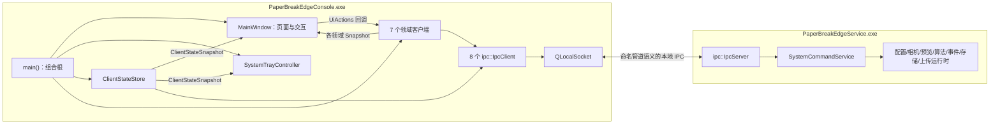
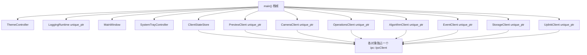
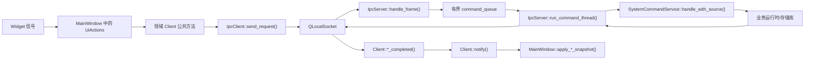
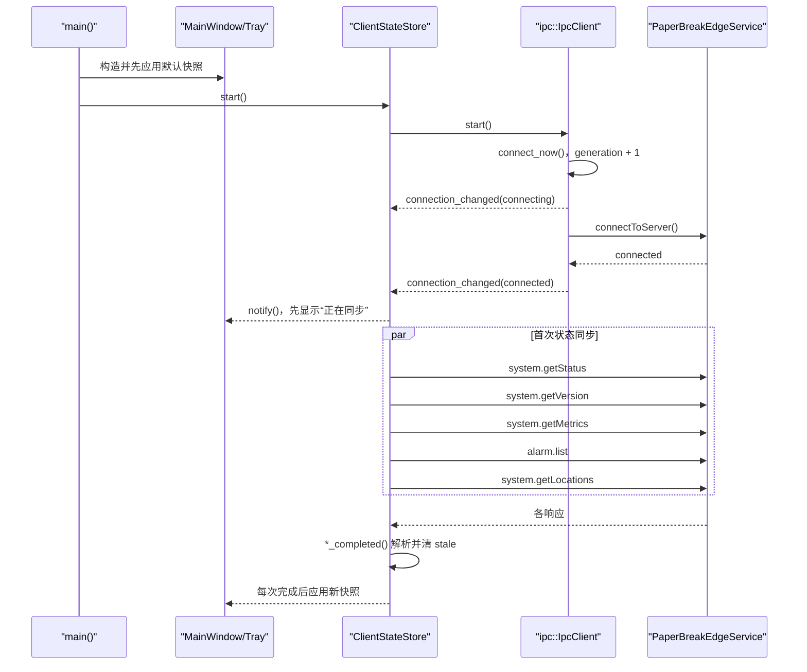
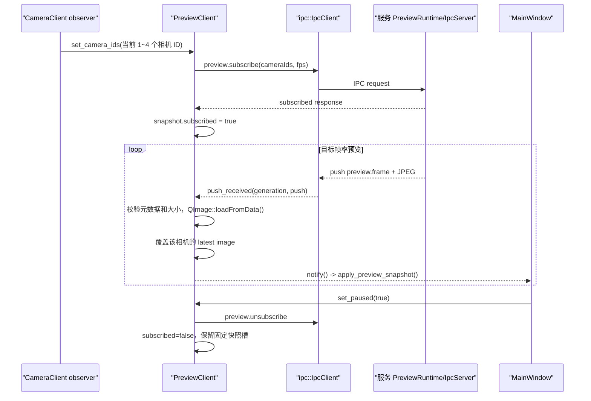
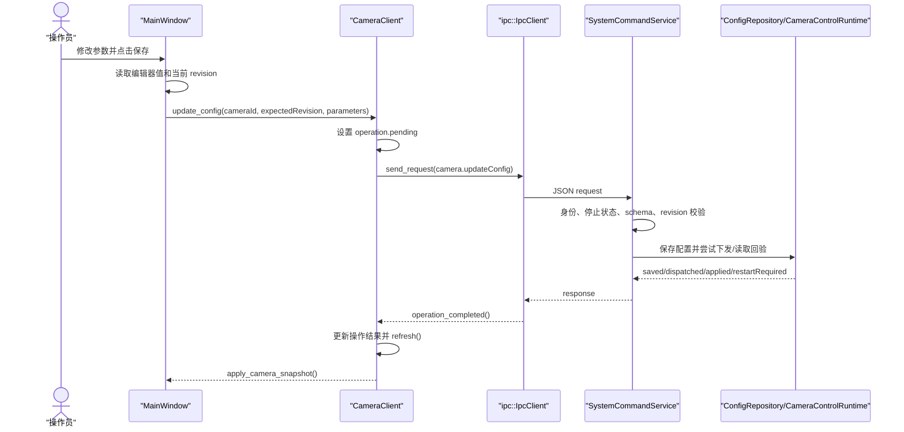
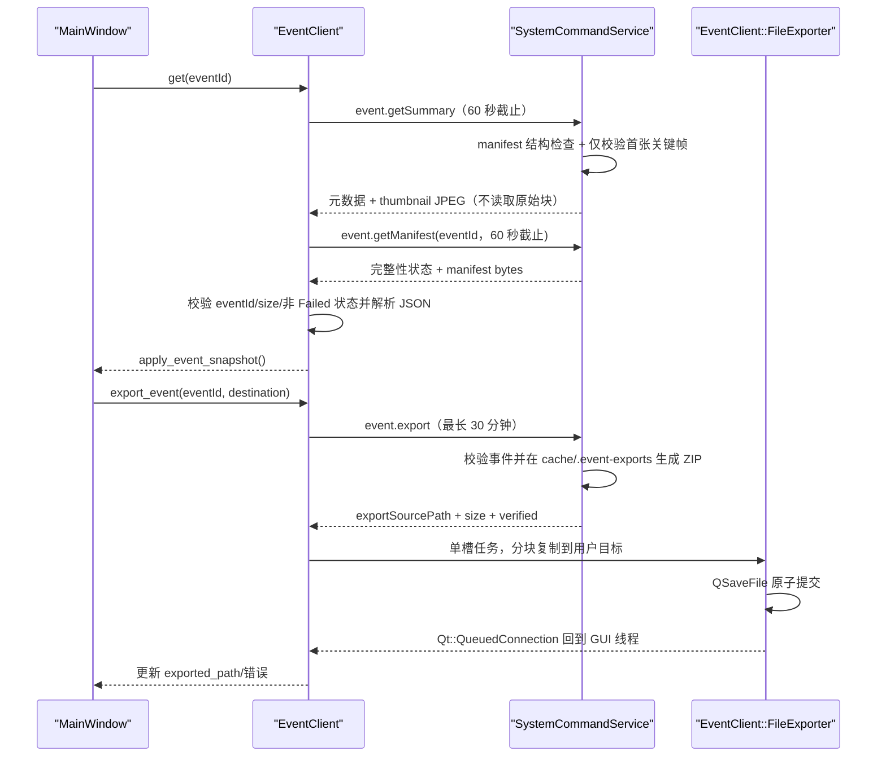

# `PaperBreakEdgeConsole.exe` 代码导读

## 1. 文档目的与边界

本文面向第一次维护 Qt 客户端的开发者，按当前工作区中的实际代码说明：

- `PaperBreakEdgeConsole.exe` 如何构建、启动和退出；
- 主要类、主要函数及对象所有权；
- Qt 界面、客户端状态模型、本地 IPC 与后台服务之间的调用关系；
- 状态同步、预览、配置修改、事件复核/导出、服务重启等关键时序；
- 当前线程、容量、过期状态和错误处理方式；
- 当前实现与架构目标之间需要特别留意的差异。

本文以源码为准，不把需求中的计划能力写成已经实现的能力。系统总体约束参见：

- [边缘系统需求](../requirements/edge-system-requirements.md)
- [系统架构](../architecture/system-architecture.md)
- [IPC 协议](../ipc-protocol.md)

Console 的核心边界是：它负责展示、交互和本机协议适配，不直接控制相机，不直接修改生产配置、SQLite 或事件目录。相机、算法、事件、存储和上位机业务最终都由 `PaperBreakEdgeService.exe` 校验并执行。

## 2. 一句话总览

`main()` 是 Console 的组合根：它创建 `QApplication`、日志、主题、`MainWindow`、托盘和 8 个领域客户端；每个领域客户端各自拥有一个 `ipc::IpcClient`，通过本地 `QLocalSocket` 向后台服务发送请求，再把响应解析成快照并同步回调 `MainWindow::apply_*_snapshot()`。



这里的“7 个领域客户端”是 `PreviewClient`、`CameraClient`、`OperationsClient`、`AlgorithmClient`、`EventClient`、`StorageClient` 和 `UplinkClient`；再加上 `ClientStateStore`，正常运行时共创建 8 个 `ipc::IpcClient` 实例。

## 3. 构建目标与依赖边界

[src/console/CMakeLists.txt](../../src/console/CMakeLists.txt) 定义两个目标：

| CMake 目标 | 类型 | 主要内容 | 关键依赖 |
| --- | --- | --- | --- |
| `paperbreak_console_model` | 静态库 | 8 个状态/领域客户端、导航模型、托盘状态模型 | `paperbreak_common`、`paperbreak_ipc`、Qt Core/Gui、nlohmann-json |
| `PaperBreakEdgeConsole` | `WIN32` 可执行文件 | `main.cpp`、`MainWindow`、托盘、主题 | `paperbreak_console_model`、日志、Windows 服务控制、Qt Widgets |

重要依赖方向：

```text
Qt Widgets 壳层
    -> paperbreak_console_model
        -> paperbreak_ipc
            -> paperbreak_common

Qt Widgets 壳层
    -> paperbreak_windows_service_control   （仅托盘“重启后台服务”）
    -> paperbreak_logging
```

该目标没有链接 Hikrobot MVS SDK、相机实现、SQLite 或服务运行时。Console 与这些生产能力的连接点是版本化 IPC DTO，而不是服务进程中的 C++ 对象。

## 4. 入口、启动模式和对象所有权

### 4.1 `main()` 的决策流程

入口位于 [src/console/main.cpp](../../src/console/main.cpp)：

1. `--version`：直接输出 `format_version_info()`，不创建 Qt 界面。
2. 创建 `QApplication`，设置应用名、组织名、版本，并调用 `setQuitOnLastWindowClosed(false)`。
3. 识别 `--smoke-test`；该模式使用临时主题配置并在短时间后自动退出。
4. 创建 `ThemeController` 和 `LoggingRuntime`。
5. 先创建 `MainWindow`，向构造函数注入一组 `UiActions` 回调；这些回调按引用捕获稍后才赋值的客户端智能指针。
6. 创建各领域客户端，并把它们的观察者绑定到 `MainWindow::apply_*_snapshot()`。
7. 创建 `SystemTrayController`，装配打开窗口、重启服务、打开事件目录、导出诊断包、退出等回调。
8. 创建 `ClientStateStore`，其观察者同时更新托盘和主窗口。
9. 启动状态连接和各领域连接，创建 1 秒刷新定时器、1 秒时钟定时器。
10. 进入 `QApplication::exec()`。
11. 事件循环退出后，停止定时器和所有客户端，停止/等待重启线程，隐藏窗口与托盘，关闭日志。

`--smoke-test` 不启动各领域客户端，而是向窗口应用合成快照，检查页面、控件、主题、托盘和隐藏/恢复行为。CTest 中的入口是 [tests/CMakeLists.txt](../../tests/CMakeLists.txt) 里的 `qt_console_smoke`。

### 4.2 组合根为什么先创建窗口、后创建客户端

`MainWindow` 不保存 `CameraClient*`、`EventClient*` 等对象指针，而是保存 `CameraUiActions`、`EventUiActions` 等 `std::function`。`main()` 中的回调捕获对应的 `std::unique_ptr` 变量：

```text
MainWindow 构造
    -> 保存 UiActions lambda
    -> 此时 client unique_ptr 仍为空

随后创建 Client
    -> unique_ptr 获得实际对象
    -> 原 lambda 再被按钮触发时可访问该对象
```

每个回调都先检查客户端是否已初始化，未初始化时返回稳定的 `IPC_NOT_CONNECTED` 业务错误。这种装配方式把界面构造与客户端对象创建的先后依赖限制在 `main()` 中。

### 4.3 主要对象所有权



除两个私有导出器和按需创建的服务重启任务外，这些对象都在 Qt GUI 主线程创建、调用和销毁。

## 5. 通用状态更新模式

所有 `*Client` 基本遵循同一条双向路径：

```text
用户输入或定时器
  -> MainWindow 中的 Qt signal/lambda
  -> UiActions
  -> *Client 公共方法
  -> ipc::IpcClient::send_request()
  -> 服务端响应
  -> *Client::*_completed()
  -> 更新 *Snapshot
  -> notify()
  -> main() 注入的 observer
  -> MainWindow::apply_*_snapshot()
```

这不是 Qt Model/View 的 `QAbstractItemModel` 实现，而是“普通 C++ 快照 + 同步观察者回调”。`notify()` 都捕获并吞掉观察者异常，避免异常穿过 Qt 事件循环或 IPC 回调边界。

快照通常包含：

- `ipc::ClientConnectionSnapshot connection`：连接状态和连接代次；
- 领域数据；
- `stale` 或多个细分的 `*_stale` 标志；
- 一个或多个在途请求句柄；
- `operation_pending`/`operation`；
- `std::optional<Error>`。

断线时客户端不会把旧值伪装成实时值，而是标记为过期、清除在途句柄并通知界面。`ClientRequestHandle` 同时携带 UUID `request_id` 和 `generation`；完成回调通常会核对句柄与当前连接代次，从而忽略旧连接的迟到结果。

## 6. 主要类和主要函数

### 6.1 Qt 壳层与组合根

| 类/函数 | 文件 | 主要职责 | 关键调用关系 |
| --- | --- | --- | --- |
| `main()` | [main.cpp](../../src/console/main.cpp) | 唯一组合根；创建、连接、启动和停止全部 Console 对象 | 构造 `MainWindow`、托盘和所有客户端；安装 `QTimer`；进入 `application.exec()` |
| `MainWindow::MainWindow()` | [main_window.cpp](../../src/console/src/main_window.cpp) | 以代码方式创建 12 个页面和全部 Widgets，连接按钮、筛选器、导航和预览操作 | 用户信号调用注入的 `UiActions`；不直接发送 IPC |
| `MainWindow::apply_snapshot()` | 同上 | 应用服务状态、版本、指标、报警和连接状态 | 由 `ClientStateStore` 的 observer 调用 |
| `MainWindow::apply_*_snapshot()` | 同上 | 分别渲染预览、相机、运维、算法、事件、存储、上位机快照 | 由对应领域客户端 observer 调用 |
| `MainWindow::closeEvent()` | 同上 | 隐藏窗口并忽略关闭事件 | 点击窗口关闭按钮不会退出 Console |
| `MainWindow::request_diagnostics_export()` | 同上 | 选择目标文件并调用运维导出动作 | 最终到 `OperationsClient::export_diagnostics()` |
| `ThemeController` | [theme_controller.cpp](../../src/console/src/theme_controller.cpp) | 读取/保存系统、浅色、深色主题并应用调色板/样式 | `MainWindow` 的主题选择器调用 `set_mode()` |

`MainWindow` 本身是当前最大的 Console 实现文件。构造函数同时承担页面创建、控件初始化和信号连接；`apply_*_snapshot()` 承担“快照到控件”的映射。

### 6.2 导航与托盘

| 类/函数 | 文件 | 主要职责 |
| --- | --- | --- |
| `console_pages()` | [navigation_model.cpp](../../src/console/src/navigation_model.cpp) | 提供 12 个页面的稳定顺序、键和中文标题 |
| `console_page_index()` | 同上 | 把 `ConsolePageId` 映射为页面索引；托盘“显示当前状态”用它跳到设备状态页 |
| `SystemTrayController::SystemTrayController()` | [system_tray_controller.cpp](../../src/console/src/system_tray_controller.cpp) | 创建菜单、托盘图标和双击/菜单回调 |
| `SystemTrayController::apply_snapshot()` | 同上 | 更新颜色、提示文本、菜单可用性，并在黄/红状态变化时显示通知 |
| `tray_status()` | [tray_status_model.cpp](../../src/console/src/tray_status_model.cpp) | 依据连接、服务状态和最高报警等级计算灰/红/黄/绿 |

页面顺序为：总览、实时预览、相机配置、算法配置、事件配置、存储配置、上位机配置、设备状态、报警、事件、日志、维护。

### 6.3 状态与领域客户端

| 类 | 文件 | 关键公共函数 | 关键完成/内部函数 | 快照用途 |
| --- | --- | --- | --- | --- |
| `ClientStateStore` | [client_state_store.cpp](../../src/console/src/client_state_store.cpp) | `start()`、`stop()`、`refresh_dynamic()` | `connection_changed()`、`push_received()`、`synchronize_*()`、`*_completed()` | 顶栏、总览、托盘、事件目录位置 |
| `PreviewClient` | [preview_client.cpp](../../src/console/src/preview_client.cpp) | `start()`、`set_camera_ids()`、`set_paused()` | `subscribe()`、`unsubscribe()`、`push_received()` | 最多六路最新预览图和统计，按逻辑 ID 写入固定槽位 |
| `CameraClient` | [camera_client.cpp](../../src/console/src/camera_client.cpp) | `refresh()`、`discover()`、`bind()`、`control()`、`update_config()` | `send_operation()`、`list_completed()`、`operation_completed()` | 相机列表、发现结果、保存/实际参数和操作状态 |
| `OperationsClient` | [operations_client.cpp](../../src/console/src/operations_client.cpp) | `refresh()`、`query_alarms()`、`query_logs()`、`acknowledge()`、两个导出函数 | `refresh_*()`、`*_completed()`、私有 `FileExporter` | 指标、报警、日志和导出状态 |
| `AlgorithmClient` | [algorithm_client.cpp](../../src/console/src/algorithm_client.cpp) | `select_camera()`、`refresh()`、`update_configuration()`、`test_current_frame()` | `config_completed()`、`operation_completed()` | 保存/生效配置、运行状态、性能和测试图 |
| `EventClient` | [event_client.cpp](../../src/console/src/event_client.cpp) | `refresh()`、`query()`、`get()`、`update_configuration()`、`manual_trigger()`、`review()`、`export_event()`、`retry_upload()` | `detail_completed()`、`manifest_completed()`、`operation_completed()`、私有 `FileExporter` | 事件配置、分页列表、详情、缩略图、manifest 和导出状态 |
| `StorageClient` | [storage_client.cpp](../../src/console/src/storage_client.cpp) | `refresh()`、`update_configuration()` | `config_completed()`、`update_completed()` | 保存/生效存储配置、重启路径 |
| `UplinkClient` | [uplink_client.cpp](../../src/console/src/uplink_client.cpp) | `refresh()`、`update_configuration()` | `config_completed()`、`update_completed()` | 保存/生效上位机配置、重启路径 |

`CameraClient` 的 observer 还有一条额外连接：每当相机列表更新，`main()` 会提取相机 ID 并调用 `PreviewClient::set_camera_ids()`，使预览订阅跟随当前相机拓扑。

总览与实时预览都固定按第一行 CAM01～CAM03、第二行 CAM04～CAM06 的 2×3 布局显示。稀疏配置不会压缩槽位，例如只配置 CAM05 时仍显示在第二行中间。布局选择器提供六宫格和六个单路入口；聚焦窗格跨越两行三列，全屏退出后恢复原固定位置。相机绑定槽和算法相机选择器同样覆盖 CAM01～CAM06。

算法页的运行指标由 [algorithm_metrics.cpp](../../src/console/src/algorithm_metrics.cpp) 中的固定登记表驱动。登记表完整覆盖 34 项运行指标（含重新布防锁存和抑制计数），并统一提供中文名称、分组、单位、口径说明和数值提取；卡片、共享曲线和 CSV 导出共用同一份定义。`AlgorithmClientSnapshot` 的本地采样序号与时间只在成功解析新的 `algorithm.getConfig` 响应后更新。页面每次收到快照时，以该序号去重，并按相机和指标分别保留最近 100 个点；这些曲线数据仅存在 Console 内存中，不写配置、不发回服务端。

“导出当前值 CSV”只导出当前相机最新快照的 34 项运行指标；如果已有最近一次隔离单帧测试，则附带该测试返回的全部调试指标。导出使用 UTF-8 BOM、标准 CSV 转义和 `QSaveFile` 原子提交，过期快照会被拒绝。传统视觉的 11 项已知调试指标使用固定中文定义，未知插件指标保留插件原名称并使用通用说明。

### 6.4 IPC 客户端与服务端终点

| 类/函数 | 文件 | 主要职责 |
| --- | --- | --- |
| `ipc::IpcClient` | [ipc/client.cpp](../../src/ipc/src/client.cpp) | 单线程 Qt 本地套接字客户端；连接、重连、帧编解码、请求关联、超时和推送回调 |
| `IpcClient::Impl::send_request()` | 同上 | 生成 UUID，编码请求，检查在途数和待发送字节容量，写入 `QLocalSocket`，登记截止时间 |
| `IpcClient::Impl::read_available()` | 同上 | 分批读取并解码响应/推送；每轮最多处理 64 帧，余量下一次事件循环继续 |
| `IpcClient::Impl::schedule_reconnect()` | 同上 | 进入 `retry_wait`，按 250 ms 到 10 s 的指数退避加抖动重连 |
| `ipc::IpcServer::Impl::handle_frame()` | [ipc/server.cpp](../../src/ipc/src/server.cpp) | 服务端认证、重复 ID/容量检查，并把请求放入有界命令队列 |
| `ipc::IpcServer::Impl::run_command_thread()` | 同上 | 在服务命令线程调用 `IRequestHandler::handle()`，再把结果投递回服务 IPC 事件线程 |
| `SystemCommandService::handle()` | [system_commands.cpp](../../src/service/core/src/system_commands.cpp) | 校验本机已认证身份，并转入统一命令分发器 |
| `SystemCommandService::handle_with_source()` | 同上 | 校验 payload、停止状态、配置修订和业务权限，再调用配置、相机、预览、事件、存储等运行时 |

完整的跨进程调用链为：



图中的连线不全是 C++ 直接调用：`QLocalSocket` 两侧是跨进程消息；服务端命令队列跨线程；`notify()` 到窗口是当前 GUI 线程中的同步回调。

## 7. IPC 命令与客户端映射

| 发起者 | 请求命令 | 推送事件 | 用途 |
| --- | --- | --- | --- |
| `ClientStateStore` | `system.getStatus`、`system.getVersion`、`system.getMetrics`、`alarm.list`、`system.getLocations` | `status.changed`、`alarm.raised`、`alarm.cleared`、`alarm.acknowledged` | 顶层状态、托盘、总览和目录位置 |
| `PreviewClient` | `preview.subscribe`、`preview.unsubscribe` | `preview.frame` | 管理订阅并接收 JPEG + 元数据 |
| `CameraClient` | `camera.list`、`camera.discover`、`camera.bind`、`camera.connect`、`camera.disconnect`、`camera.start`、`camera.stop`、`camera.getConfig`、`camera.updateConfig`、`camera.captureSnapshot`、`camera.softwareTrigger` | 无 | 相机拓扑、参数和控制 |
| `OperationsClient` | `system.getMetrics`、`alarm.list`、`log.tail`、`alarm.acknowledge`、`system.exportDiagnostics` | 三种 `alarm.*` 推送 | 运维、报警、日志和诊断包 |
| `AlgorithmClient` | `algorithm.getConfig`、`algorithm.updateConfig`、`algorithm.testCurrentFrame` | 无 | 算法配置、运行指标和隔离测试 |
| `EventClient` | `event.getConfig`、`event.updateConfig`、`event.list`、`event.getSummary`、`event.getManifest`、`event.manualTrigger`、`event.confirm`、`event.reject`、`event.export`、`event.retryUpload` | `event.committed` | 事件配置、查询、复核、导出和重传 |
| `StorageClient` | `storage.getConfig`、`storage.updateConfig` | 无 | 存储配置 |
| `UplinkClient` | `uplink.getConfig`、`uplink.updateConfig` | 无 | 上位机配置 |

配置更新通常带 `expectedConfigRevision`，事件复核带 `expectedReviewRevision`。这些乐观并发修订由服务端重新校验；Console 不能仅凭界面中的旧值覆盖新配置。

## 8. 核心时序

### 8.1 启动、连接和首次同步



其他领域客户端在各自连接进入 `connected` 后也会立即 `refresh()`；`CameraClient` 还会自动执行一次 `discover()`，`PreviewClient` 在未暂停时自动 `subscribe()`。

### 8.2 周期刷新、报警推送和断线恢复

`refresh_timer` 每秒调用：

- `ClientStateStore::refresh_dynamic()`；
- `CameraClient::refresh()`；
- `OperationsClient::refresh()`；
- `AlgorithmClient::refresh()`；
- `EventClient::refresh()`；
- `StorageClient::refresh()`；
- `UplinkClient::refresh()`。

各客户端使用 `std::optional<ClientRequestHandle>` 阻止同类请求重入，因此一次请求尚未完成时，下一次 timer tick 不会为同一槽位无限追加请求。

`ClientStateStore` 的状态、版本和位置只在 stale 时重查，指标和报警每秒刷新。报警推送到达时，如果报警查询正在进行，则设置 `alarm_push_refresh_pending_`；当前查询完成后再补一次查询，避免丢掉查询期间发生的状态变化。

断线时 `IpcClient` 让该 generation 的全部在途请求失败，进入指数退避重连。领域客户端收到连接变化后标记快照过期；新 generation 连接成功后重新查询，不假设服务会重放断线期间的推送。

### 8.3 实时预览订阅、推送和暂停



实时预览页提供 2、3、5、10、20、30 fps。选择新值时 `PreviewClient::set_target_fps()` 取消旧的
在途订阅并以当前相机集合重新订阅；断线重连沿用当前选择。该值是连接级临时状态，不写生产
配置，也不改变相机采集帧率。服务同一相机按所有订阅中的最高目标帧率编码一次，并对较低帧率
订阅独立限速。

暂停只取消预览订阅，不停止后台相机采集。`PreviewSnapshot::images` 是固定 4 槽数组，每台相机只保留最新成功解码的图像。

预览图像标签使用忽略 pixmap `sizeHint` 的扩展尺寸策略，2×2 窗格不会因输入帧分辨率或宽高比变化而重新分配尺寸。任一窗格连续双击按“四宫格 → 该窗格独占视频区 → 该窗格顶层全屏 → 四宫格”循环；独占时选中窗格跨越 2×2 网格的全部行列，独占和全屏状态均强制把图像铺满整个窗格/屏幕。帧信息以浮层方式叠加而不占用图像高度，恢复四宫格时四个窗格重新放回各自单元格，并恢复用户选择的 1:1 或自适应模式。全屏时按 Esc 或关闭全屏窗格也会恢复四宫格。页面“全屏”按钮复用同一窗格级状态，不会把整个控制台外壳误当作视频全屏。

### 8.4 以相机参数保存为例的写操作



连接、断开、开始/停止采集等危险操作由 `MainWindow::run_camera_control()` 触发，部分命令会先显示确认对话框。真正的合法性、服务停止状态和设备状态校验仍在服务端。

### 8.5 事件详情、manifest 校验和导出

事件详情不是单次请求完成：



事件导出没有把整个 ZIP 放进 IPC 二进制帧，而是由服务先在受控缓存目录创建、校验 ZIP，再把暂存路径返回给本机 Console；Console 的导出线程只把该服务端已校验文件复制到用户选择的位置。

诊断包采用另一种路径：`system.exportDiagnostics` 直接在 IPC 响应的 binary 中返回脱敏 ZIP，`OperationsClient` 校验 `contentType`、`size` 和 `redacted` 后交给自己的单槽 `FileExporter` 写入 `QSaveFile`。

### 8.6 托盘重启服务与退出

托盘“重启后台服务”不走 IPC，因为服务可能正是不可连接的对象。该动作创建一个 `std::jthread`：

```text
托盘 QAction
  -> restart_running.exchange(true)，拒绝并发重启
  -> ServiceManager::restart(service_name, 30 s, stop_token)
  -> QMetaObject::invokeMethod(..., Qt::QueuedConnection)
  -> GUI 线程记录日志并显示结果对话框
```

窗口右上角关闭只调用 `MainWindow::closeEvent()` 隐藏窗口；托盘仍然运行。只有托盘“退出界面”调用 `QApplication::quit()`，随后才执行确定性的停止顺序：停止 timer → 停止/销毁全部客户端 → 请求并等待重启线程 → 隐藏窗口/托盘 → 关闭日志。退出 Console 不停止后台服务。

## 9. 线程、容量和背压

### 9.1 Console 进程中的线程

| 线程 | 创建条件 | 执行内容 | 回到 GUI 的方式 | 关闭路径 |
| --- | --- | --- | --- | --- |
| Qt GUI 主线程 | 始终 | Widgets、托盘、8 个 `IpcClient`、JSON 解析、快照更新、当前预览 JPEG 解码 | 本线程同步回调 | `application.exec()` 返回后依次 `stop()` |
| `OperationsClient::FileExporter` | 正常构造 `OperationsClient` | 诊断 ZIP/报警 CSV 分块写入 `QSaveFile` | `QMetaObject::invokeMethod(..., QueuedConnection)` | `request_stop()`、唤醒条件变量、`join()` |
| `EventClient::FileExporter` | 正常构造 `EventClient` | 从服务校验的暂存路径分块复制事件 ZIP并原子提交 | 同上 | `request_stop()`、唤醒、`join()` |
| `restart_task` | 用户点击重启服务时 | 调用 Windows SCM 并等待最多 30 秒 | 同上 | 应用退出时 `request_stop()`、`join()` |

服务端 IPC 事件线程和命令线程属于 `PaperBreakEdgeService.exe`，不属于 Console，但请求会通过服务端有界命令队列跨越这两个线程。

### 9.2 有界资源

| 资源 | 容量/限制 | 满载策略 |
| --- | ---: | --- |
| 每个 `IpcClient` 在途请求 | 128 | 新请求返回 `IPC_BUSY` |
| 每个 `IpcClient` 待发送字节 | 32 MiB | 新请求返回 `IPC_BUSY` |
| IPC header/binary | 1 MiB / 16 MiB | 编解码前拒绝超限帧 |
| `IpcClient::read_available()` 单轮解码 | 64 帧 | 用零延迟 `singleShot` 续读，给事件循环让出机会 |
| 各领域同类操作 | 通常 1 个 `optional<RequestHandle>` | 返回 busy 或跳过本次周期刷新 |
| 运维文件导出 | 1 个任务 | 已 busy 时拒绝新任务 |
| 事件文件导出 | 1 个任务 | 已有任务时拒绝新任务 |
| 服务重启 | 1 个任务 | `restart_running` 为真时提示正在重启 |
| 预览显示缓存 | 每相机 1 槽，共 4 槽 | 新帧覆盖旧帧，latest-wins |

服务端默认最多 8 个活动连接。当前正常 Console 正好创建 8 个独立连接，因此理解连接数、诊断客户端并存和后续扩展时不能继续沿用“Console 固定 5 条连接”的旧假设。

算法曲线历史也是有界资源：每相机、每运行指标最多 100 个有效采样点，满载时删除最旧点；重复观察者通知、请求开始、失败响应和操作状态变化不追加采样。该模型不创建线程或队列，随 Console 进程退出释放。

## 10. 连接、错误和过期数据语义

`ipc::ClientConnectionState` 有四个状态：`stopped`、`connecting`、`connected`、`retry_wait`。关键行为如下：

- 连接失败或断开：进入 `retry_wait`，记录 `last_error` 和下一次延迟；
- 重连代次：每次 `connect_now()` 增加 `generation`；
- 连接丢失：该 generation 的所有请求以关联后的连接错误完成；
- 请求超时：返回 `IPC_REQUEST_TIMEOUT`，不让请求永久占用槽位；
- 协议错误：关闭当前连接、使请求失败并重连；
- 服务业务失败：IPC 响应本身到达，但 `ResponseMessage.success == false`，领域客户端把服务端稳定错误写入快照。

界面端使用 stale 语义，而不是简单清空所有字段：

- 顶栏和总览会在旧值后显示过期含义；
- 连接断开时明确显示“后台服务连接中断”；
- 写配置前，算法、事件、存储和上位机客户端会拒绝使用未同步的配置修订；
- 相机操作断线时显示“操作结果未知”，随后通过新连接重新查询实际状态；
- `MainWindow::apply_snapshot()`、`apply_camera_snapshot()` 等函数统一决定控件是否启用和状态文本。

## 11. 当前实现中容易误读的细节

### 11.1 当前是 8 条 IPC 连接，不是 5 条

[系统架构](../architecture/system-architecture.md) 第 7.4 节仍写着 Console 固定使用 5 条隔离连接，但当前 `main()` 实际启动 8 个各自持有 `IpcClient` 的对象。阅读性能指标或排查连接被拒绝时应以当前代码为准。

### 11.2 预览 JPEG 当前在 GUI 线程解码

架构目标要求 JPEG 解码进入固定工作线程和每相机单槽 mailbox；当前 `PreviewClient::push_received()` 直接调用 `QImage::loadFromData()`。现有快照存储确实是每相机 latest-wins，但解码执行位置尚未达到目标设计。本文只记录该差异，不在文档任务中修改实现。

### 11.3 托盘绿色不直接遍历相机状态

`tray_status()` 只接收 `ClientStateSnapshot`，依据服务状态与最高报警等级决定颜色；它不读取 `CameraClientSnapshot`。因此“绿色”实际表示服务运行且当前报警汇总没有 Warning/Error/Critical，而不是托盘模型直接确认每台启用相机均正常。相机故障能否反映为黄/红依赖服务报警链。

### 11.4 托盘预览动作目前是提示项

`SystemTrayController` 中的预览菜单项文本为“请在实时预览页暂停/恢复”，并始终禁用。暂停/恢复能力位于主窗口实时预览页，不是托盘菜单直接动作。

### 11.5 状态轮询存在职责重叠

`ClientStateStore` 为总览查询指标和活动报警，`OperationsClient` 为详细页面再次查询指标、报警和日志。两者是独立连接、独立快照和独立请求，并非共享缓存。

### 11.6 两类导出的传输方式不同

- 诊断包：服务通过 IPC binary 返回，Console 工作线程写目标文件；
- 事件 ZIP：服务在受控缓存生成文件并返回暂存路径，Console 工作线程复制；
- 报警 CSV：Console 使用已查询到的报警快照本地生成，再交给工作线程写入。

## 12. 推荐阅读顺序

首次阅读建议按以下顺序：

1. [src/console/CMakeLists.txt](../../src/console/CMakeLists.txt)：确认可执行文件和模型库边界。
2. [src/console/main.cpp](../../src/console/main.cpp)：理解组合根、依赖注入、启动和停止。
3. [navigation_model.cpp](../../src/console/src/navigation_model.cpp) 与 [main_window.hpp](../../src/console/src/main_window.hpp)：先看页面和动作接口，再进入庞大的窗口实现。
4. [client_state_store.hpp](../../src/console/include/paperbreak/console/client_state_store.hpp) 与其实现：理解连接、generation、stale 和 observer 模式。
5. [ipc/client.hpp](../../src/ipc/include/paperbreak/ipc/client.hpp) 与 [ipc/client.cpp](../../src/ipc/src/client.cpp)：理解全部领域客户端共用的异步底座。
6. 按业务需要选择 `camera_client.cpp`、`preview_client.cpp`、`event_client.cpp` 等一个领域客户端，顺着 `send_request()` 到 `*_completed()` 阅读。
7. [ipc/server.cpp](../../src/ipc/src/server.cpp) 和 [system_commands.cpp](../../src/service/core/src/system_commands.cpp)：追踪跨进程后的认证、队列和业务终点。
8. [tests/unit/client_state_store_tests.cpp](../../tests/unit/client_state_store_tests.cpp)、[tests/unit/ipc_client_tests.cpp](../../tests/unit/ipc_client_tests.cpp) 和 [tests/unit/system_command_tests.cpp](../../tests/unit/system_command_tests.cpp)：用测试确认重连、协议、各领域 DTO 和服务命令语义。

调试某个按钮时，最短定位方法是：先在 `main_window.cpp` 搜索控件的 `objectName` 或按钮文本，找到其 `QObject::connect` lambda；再查对应 `UiActions` 字段、领域客户端公共方法、IPC 命令字符串和 `SystemCommandService::handle_with_source()` 的同名分支。

## 13. 线程日志

控制台自有线程固定命名为 `console-gui`、`console-service-restart`、
`console-event-export` 和 `console-diagnostics-export`，均在入口注册逻辑名称并同步 Windows 线程描述。
控制台日志按线程写入
`%TEMP%\PaperBreakEdge\logs\paperbreak-console-<thread-name>-YYYY-MM-DD.log[.N]`。

连接后从 `system.getStatus.loggingLevel` 同步最低等级；旧服务缺少字段或首次连接前使用 `info`，
断线时保留最后有效值。`log.tail` 可按 `threadName` 过滤，日志页面显示“线程名（线程 ID）”。
