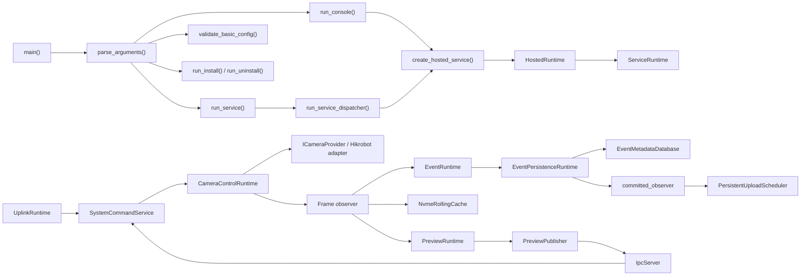
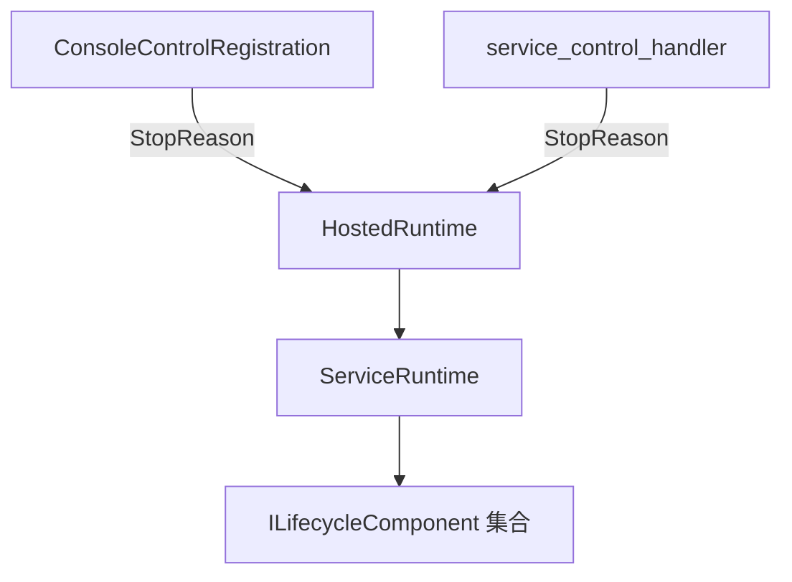
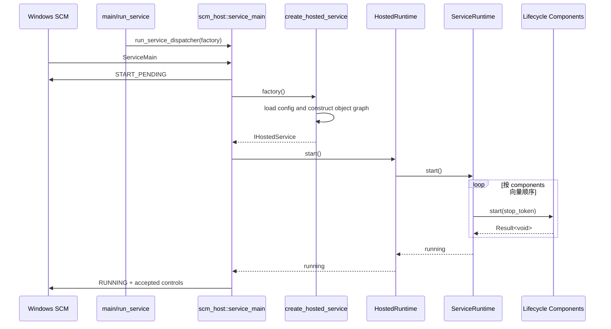
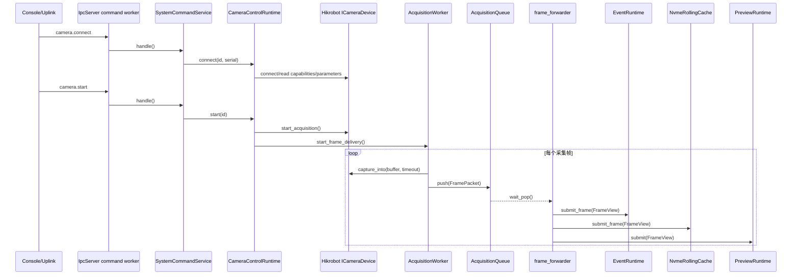
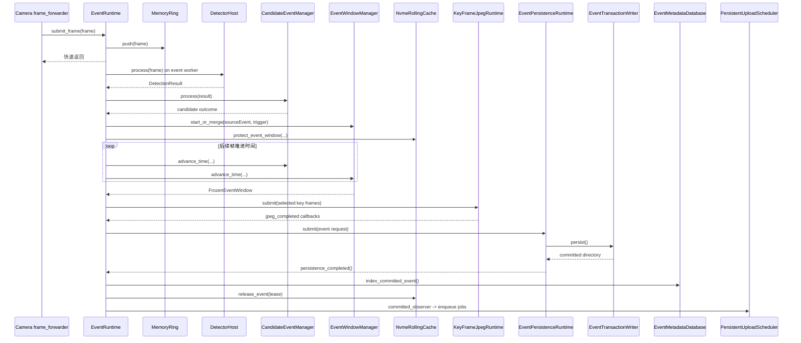
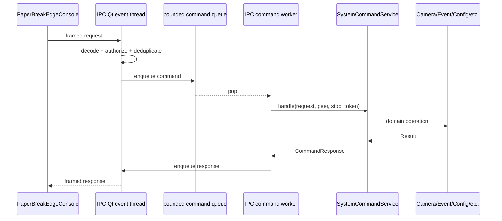
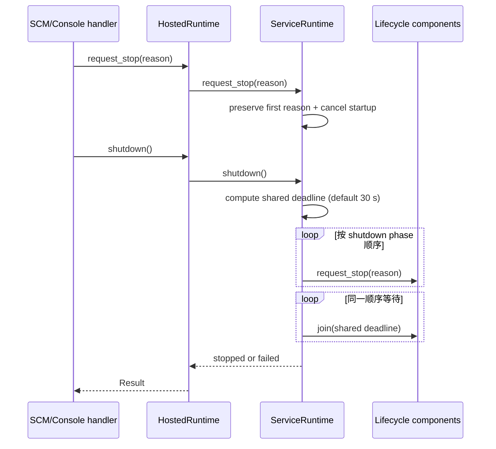

# `PaperBreakEdgeService.exe` 代码导读

## 1. 文档目的与阅读范围

本文按当前仓库代码说明 `PaperBreakEdgeService.exe` 的实际实现，重点回答：

- 可执行文件从哪里进入、如何选择运行模式；
- 组合根如何创建并连接主要对象；
- 主要类和函数各自负责什么、谁调用谁；
- Windows 服务启动/停止、相机采集、事件落盘、IPC 命令和上传的时序；
- 工作线程、队列容量和溢出策略位于哪里；
- 哪些仓库类型虽然存在，但当前并未装配进该可执行文件。

本文以源码为准，架构背景参见：

- `docs/requirements/edge-system-requirements.md`
- `docs/architecture/system-architecture.md`
- `docs/ipc-protocol.md`
- `docs/uplink-protocol-v1.md`

主要代码入口：

- 目标定义：`src/service/CMakeLists.txt`
- 进程入口和组合根：`src/service/main.cpp`
- 宿主无关生命周期：`src/service/core/src/runtime.cpp`
- Windows SCM 宿主：`src/service/windows/src/scm_host.cpp`
- 业务命令分发：`src/service/core/src/system_commands.cpp`
- 帧到事件的主链路：`src/service/core/src/event_runtime.cpp`

> 说明：本文描述的是当前代码，不把架构文档中的目标形态误写成已经接入的实现。例如仓库有 `ProcessingRuntime` 和 `PerCameraProcessor`，但当前 `PaperBreakEdgeService.exe` 的组合根没有实例化它们。

## 2. 一句话总览

`main()` 解析运行模式；`create_hosted_service()` 作为组合根加载配置并创建全部生产适配器；`HostedRuntime` 用 `ServiceRuntime` 统一管理可启动组件；相机由 IPC/Uplink 命令按需连接和启动，采集帧经 `CameraControlRuntime` 直接扇出到事件、NVMe 滚动缓存和预览三条有界异步链路。



## 3. 构建目标和模块依赖

`src/service/CMakeLists.txt` 创建 `PaperBreakEdgeService`，最终输出名为 `PaperBreakEdgeService.exe`。该目标直接链接：

| 目标 | 在本 exe 中的用途 |
| --- | --- |
| `paperbreak_service_core` | 生命周期、事件运行时、系统命令处理 |
| `paperbreak_windows_service` | SCM 宿主、安装/卸载与控制台控制处理 |
| `paperbreak_camera_hikrobot` | 生产相机提供者；MVS SDK 类型不越过适配器边界 |
| `paperbreak_config`、`paperbreak_platform_windows` | 配置仓库、原子文件、Windows 指标和本地安全 |
| `paperbreak_pipeline` | 当前主要使用低帧率 `PreviewRuntime` |
| `paperbreak_ipc` | 本机 `QLocalServer` 服务端 |
| `paperbreak_monitoring`、`paperbreak_logging` | 指标、报警和日志 |
| `paperbreak_uplink_transport` | Qt REST/WebSocket/HTTP 上行传输 |
| `Qt6::Core`、`nlohmann_json` | 进程基础设施与 JSON |

相机 MVS 运行库通过 `paperbreak_stage_hikrobot_runtime(PaperBreakEdgeService)` 放到运行目录。服务不链接 Qt Widgets，也不创建界面。

## 4. 进程入口和运行模式

### 4.1 `main()` 的决策流程

`src/service/main.cpp` 中的 `main()`：

1. 执行 `chcp 65001`，创建 `QCoreApplication`；
2. 调用 `parse_arguments()`，只允许一个运行模式；
3. `--version` 和 `--uninstall` 直接执行，不读取业务配置；
4. `--service` 直接进入 SCM 宿主，配置由组合根中的 `ConfigRepository::load()` 校验；
5. 其他模式先调用 `validate_basic_config()`；
6. `--validate-config` 校验后退出；
7. `--install` 写入 Windows 服务配置；
8. 剩余情况进入 `run_console()`。

| 模式 | 主要函数 | 作用 |
| --- | --- | --- |
| `--console --config ...` | `run_console()` | 开发/诊断宿主，Ctrl+C 或测试时限触发受控关闭 |
| `--service --config ...` | `run_service()` | 进入 Windows SCM dispatcher |
| `--validate-config --config ...` | `validate_basic_config()` | 只做配置校验 |
| `--install --config ...` | `run_install()` | 构造 `--service --config <绝对路径>` ImagePath 并安装/收敛服务 |
| `--uninstall` | `run_uninstall()` | 必要时停止并删除服务 |
| `--version` | `format_version_info()` | 打印版本信息 |

### 4.2 两种宿主复用同一服务核心

控制台宿主和 SCM 宿主最终都调用 `create_hosted_service()`，因此业务对象的创建、启动顺序和关闭顺序只有一套。



控制台模式使用容量为 1 的 `StopRequestChannel` 保存首个停止原因。SCM 模式使用 `StopRequestSlot` 做同样的事情，并在启动/停止较慢时由 `PendingStatusPulse` 每秒递增 checkpoint，上报 `START_PENDING`/`STOP_PENDING`。

## 5. 组合根：`create_hosted_service()`

`create_hosted_service(config_path, validate_config)` 是理解整个 exe 的中心。它按以下顺序完成对象创建和依赖注入；这里的“创建”大多还没有启动工作线程。

1. 创建 `ConfigurationResources`，调用 `ConfigRepository::load()`；
2. 根据配置创建 `LoggingRuntime`，把启动前配置审计缓冲接入日志；
3. 创建共享的 `ServiceStatusStore`、`MetricRegistry`、`AlarmRegistry`；
4. 打开 `EventMetadataDatabase`，创建 `EventInspector` 和 `StoragePolicyManager`；
5. 若启用滚动缓存，创建 `NvmeRollingCache`；
6. 若启用上行，创建 `QtUplinkTransport`、分块上传 executor 和 `PersistentUploadScheduler`，并扫描数据库中已存在事件，幂等补建上传任务；
7. 创建 `EventRuntime`；它内部创建每相机检测 lane、内存环、候选/窗口管理器、JPEG worker 和事件持久化 worker；
8. 若启用预览，创建 `PreviewRuntime` 和 `PreviewPublisher`；
9. 创建生产 `Hikrobot ICameraProvider` 和 `CameraControlRuntime`；
10. 创建 `SystemCommandService`，将配置、状态、监控、相机、事件、数据库和预览等用例入口集中注入；
11. 若启用上行，创建 `UplinkRuntime`，其远程命令仍转给同一个 `SystemCommandService`；
12. 创建 `IpcServer`，将请求交给 `SystemCommandService`；
13. 创建 `HealthMonitor` 并注册系统、IPC、数据库、事件/存储/上行、相机、算法六类指标源；
14. 向 `ConfigRepository` 注册 `MonitoringConfigApplier` 和 `EventConfigApplier`；
15. 建立服务状态/报警到 IPC push 的观察者；
16. 把需要显式启动/停止的对象包装成 `ILifecycleComponent`，返回 `HostedRuntime`。

`validate_config` 参数当前在函数开头被显式忽略；实际配置加载与强校验由 `ConfigRepository::load()` 完成。

### 5.1 帧扇出是组合根中的关键连接

`CameraControlRuntime` 构造时注入的 `CameraFrameObserver` 定义了当前生产帧主链：

```cpp
EventRuntime::submit_frame(frame);
NvmeRollingCache::submit_frame(frame);   // 仅启用滚动缓存时
PreviewRuntime::submit(frame, ...);      // 仅启用预览时
```

三个接收端都只保留 `FrameView` 的共享帧所有权，并把耗时工作交给各自线程；转发线程不做 JPEG、磁盘写入或算法推理。

## 6. 主要类与主要函数

### 6.1 入口、宿主和生命周期

| 类/函数 | 文件 | 职责和主要调用关系 |
| --- | --- | --- |
| `parse_arguments()` | `src/service/main.cpp` | 解析并约束六种运行模式、配置路径和测试运行时限 |
| `run_console()` | `src/service/main.cpp` | 创建服务、注册控制台回调、启动、等待停止、调用 `shutdown()` |
| `run_service()` | `src/service/main.cpp` | 调用 `run_service_dispatcher()`，传入服务工厂 |
| `create_hosted_service()` | `src/service/main.cpp` | 唯一生产组合根，创建并连接所有具体实现 |
| `HostedRuntime` | `src/service/main.cpp` | 适配 `IHostedService`；同步更新 `ServiceStatusStore`，转发给 `ServiceRuntime` |
| `IHostedService` | `src/service/windows/.../scm_host.hpp` | 控制台/SCM 共用的窄宿主接口：`start/request_stop/shutdown` |
| `service_main()` | `src/service/windows/src/scm_host.cpp` | 注册 SCM handler、创建服务、上报状态、等待停止、受控关闭 |
| `service_control_handler()` | 同上 | SCM 回调；只记录停止请求并调用非阻塞 `request_stop()` |
| `ServiceRuntime` | `src/service/core/.../runtime.*` | 所有显式生命周期组件的所有权根；顺序启动、失败回滚、分阶段关闭 |
| `ILifecycleComponent` | `src/service/core/.../runtime.hpp` | 统一 `name/start/request_stop/join/shutdown_phase` 协议 |

### 6.2 `main.cpp` 中的生命周期适配器

这些类没有业务算法，只把各模块不同的生命周期 API 适配到 `ILifecycleComponent`：

| 适配器 | 包装对象 | 启动/停止行为 | 关闭阶段 |
| --- | --- | --- | --- |
| `ConfigurationLifecycleComponent` | `ConfigurationResources` | 启动检查 snapshot；停止后拒绝配置变更 | `configuration` |
| `LoggingLifecycleComponent` | `LoggingRuntime` | 写启动/停止日志，最后 flush/shutdown | `logging` |
| `PreviewLifecycleComponent` | `PreviewRuntime` | 启停预览编码线程 | `processing` |
| `EventLifecycleComponent` | `EventRuntime` | 启停事件、JPEG 和持久化线程 | `event` |
| `NvmeLifecycleComponent` | `NvmeRollingCache` | 启停 NVMe 滚动写线程 | `event` |
| `StorageMaintenanceLifecycleComponent` | `StoragePolicyManager` | 每 30 秒维护存储、更新水位/报警 | `event` |
| `IpcLifecycleComponent` | `IpcServer` | 启停 Qt IPC event thread 和命令 worker | `ipc` |
| `UplinkLifecycleComponent` | `UplinkRuntime` + `PersistentUploadScheduler` | 先启动连接运行时，再启动上传调度；关闭时均请求停止 | `uplink` |
| `MonitoringLifecycleComponent` | `HealthMonitor` | 启停健康采样线程 | `monitoring` |

辅助类：

- `BufferedConfigAuditSink`：日志尚未创建时最多缓冲 64 条配置审计；`attach()` 后冲刷到审计日志。
- `PreviewPublisher`：把 JPEG 和元数据封装成 `preview.frame`，调用 `IpcServer::try_publish()`；按订阅者和相机合并最新帧。
- `MonitoringConfigApplier`、`EventConfigApplier`：配置仓库事务提交时应用运行期监控、事件和存储策略变更。
- `IpcMetricSource`、`DatabaseMetricSource`、`EventMetricSource`、`CameraMetricSource`、`AlgorithmMetricSource`：把不同模块 snapshot 转成统一指标。

### 6.3 相机采集

| 类/函数 | 文件 | 职责和调用关系 |
| --- | --- | --- |
| `ICameraProvider` / `ICameraDevice` | `src/camera/include/paperbreak/camera/camera.hpp` | 厂商无关的枚举、连接、参数和取帧接口 |
| `create_hikrobot_camera_provider()` | `src/camera/hikrobot/...` | 创建生产 MVS 实现；所有 MVS 调用留在适配器目标内部 |
| `CameraControlRuntime` | `src/camera/src/control.cpp` | 最多六路控制会话；实现 discover/connect/start/stop/update/snapshot/trigger |
| `CameraControlRuntime::start_frame_delivery()` | 同上 | 为单路创建固定帧池、有界 `AcquisitionQueue`、`AcquisitionWorker` 和转发线程 |
| `AcquisitionWorker::run()` | `src/camera/src/acquisition.cpp` | 从已启动的 `ICameraDevice` 拉帧，写入有界采集队列 |
| `CameraControlRuntime::forward_frames()` | `src/camera/src/control.cpp` | 从采集队列取帧并调用组合根注入的 frame observer |
| `CameraControlRuntime::update()` | 同上 | 采集中更新参数时停止投递和设备采集，应用参数后恢复 |

相机不会在 `ServiceRuntime::start()` 时自动连接/采集。当前实现由 `SystemCommandService` 收到 `camera.connect` 和 `camera.start` 后按需启动。相机对象也没有独立 `ILifecycleComponent`；其线程由 `camera.stop/disconnect` 或 `CameraControlRuntime` 析构清理。理解关闭路径时必须注意这一点。

### 6.4 算法、候选、事件窗口和落盘

| 类/函数 | 文件 | 职责和调用关系 |
| --- | --- | --- |
| `EventRuntime::create()` | `src/service/core/src/event_runtime.cpp` | 恢复未提交事务、数据库 reconcile，构建 pipeline、JPEG 与持久化运行时 |
| `build_pipeline()` | 同上 | 每启用相机创建 `Lane`、`MemoryRing`、`DetectorHost`；创建候选与事件窗口管理器 |
| `EventRuntime::submit_frame()` | 同上 | 先写每相机内存环，再以每路固定容量提交算法队列；满时丢最旧待检测帧 |
| `EventRuntimeImpl::run()` | 同上 | 单事件 worker 取帧并调用 `process_frame()` |
| `DetectorPluginRegistry` / `DetectorHost` | `src/algorithm/...` | 注册 mock/classical 插件，加载配置并执行 `process(frame)` |
| `CandidateEventManager::process()` | `src/event/src/candidate_event.cpp` | 根据检测结果推进候选/确认/拒绝/冷却状态 |
| `EventWindowManager::start_or_merge()` | `src/event/src/event_window.cpp` | 创建或合并事件时间窗，并租用各相机内存环中的前置帧 |
| `NvmeRollingCache::protect_event_window()` | `src/storage/src/nvme_cache.cpp` | 候选产生时保护对应 NVMe 块，提交成功后才释放租约 |
| `EventRuntimeImpl::freeze()` | `event_runtime.cpp` | 后置时间到达后冻结窗口、选择关键帧、准备 manifest 元数据 |
| `KeyFrameJpegRuntime` | `src/event/src/key_frame.cpp` | 单 worker、有界队列，异步 OpenCV JPEG 编码 |
| `EventPersistenceRuntime` | `src/storage/src/event_store.cpp` | 单 worker、有界队列，调用事务 writer 执行磁盘 I/O |
| `EventTransactionWriter::persist()` | 同上 | 写事务目录、校验文件与 manifest，原子提交事件目录 |
| `EventRuntimeImpl::persistence_completed()` | `event_runtime.cpp` | 将已提交目录索引入 SQLite、释放 NVMe 租约、调用 committed observer |

`EventRuntime` 在自动算法连续失败达到门限后，按相机持续刷新 `ALGORITHM_PROCESS_FAILED` 活动报警，但仍对后续帧调用检测器；首次成功会清除该报警。持续队列积压或算法结果队列拒绝仍属于保护性降级条件，只把来源 Lane 切换到 `manual-trigger-only`，并保留采集、缓存和人工触发路径。

### 6.5 IPC、配置和业务命令

| 类/函数 | 文件 | 职责和调用关系 |
| --- | --- | --- |
| `IpcServer` | `src/ipc/src/server.cpp` | QLocalServer 连接、鉴权、帧解码、有界命令/响应/push 队列 |
| `IpcServer::Impl::run_event_thread()` | 同上 | Qt socket 事件、连接和发送；不执行耗时业务命令 |
| `IpcServer::Impl::run_command_thread()` | 同上 | 从命令队列取请求，调用 `IRequestHandler::handle()` |
| `SystemCommandService::handle()` | `src/service/core/src/system_commands.cpp` | IPC 入口，转给 `handle_with_source()` |
| `SystemCommandService::handle_with_source()` | 同上 | 按命令名做权限、payload、状态和依赖检查，再调用具体模块 |
| `ConfigRepository::update/reload()` | `src/config/src/config_repository.cpp` | 配置版本检查、事务式 applier、原子保存和审计 |
| `ServiceStatusStore` | `system_commands.*` | 保存服务状态；状态变化通过观察者发布 `status.changed` |

主要命令分组：

- `system.*`：状态、版本、路径、指标、诊断导出、配置重载；
- `camera.*`：发现、绑定、连接、启停、参数、快照、软件触发；
- `algorithm.*`：配置、当前帧测试；
- `event.*`：人工触发、列表/详情/manifest、确认/拒绝、导出、重试上传；
- `storage.*`、`uplink.*`：读取/更新对应配置；
- `preview.*`：按连接订阅/取消；
- `alarm.*`、`log.*`：报警查询/确认和日志尾部。

本机 IPC 与远程 Uplink 不复制业务实现：`UplinkRuntime` 的 `RemoteCommandExecutor` 调用 `SystemCommandService::handle_uplink_command()`，后者校验远程确认和审计要求后，再映射到同一业务分发逻辑。

### 6.6 存储、监控和上传

| 类/函数 | 文件 | 职责和调用关系 |
| --- | --- | --- |
| `EventMetadataDatabase` | `src/storage/src/metadata_database.cpp` | 事件索引、复核状态和持久上传任务 |
| `StoragePolicyManager` | `src/storage/src/storage_policy.cpp` | 磁盘水位、大写入准入、保留和清理 |
| `NvmeRollingCache` | `src/storage/src/nvme_cache.cpp` | 每相机聚合固定时长块，异步滚动写、索引、回收和事件租约 |
| `HealthMonitor` | `src/monitoring/src/monitoring.cpp` | 周期采集 `IMetricSource`，写 `MetricRegistry` 并计算报警 |
| `AlarmRegistry` | 同上 | 报警 raise/clear/acknowledge 和观察者通知 |
| `UplinkRuntime` | `src/uplink/src/runtime.cpp` | 单 worker 连接/重连、心跳、状态和远程命令；传输回调只入有界队列 |
| `PersistentUploadScheduler` | `src/uplink/src/upload_scheduler.cpp` | 从 SQLite 认领持久任务，执行上传并记录重试/最终状态 |
| `QtUplinkTransport` | `src/uplink/transport/src/qt_transport.cpp` | REST/WebSocket/分块 HTTP 的具体 Qt 适配 |
| `enqueue_committed_event_uploads()` | `src/service/main.cpp` | 按策略读取 manifest，为报警、manifest、关键帧、回放和原始文件创建幂等任务 |

## 7. 核心时序

### 7.1 Windows 服务启动



启动组件的实际顺序是：

1. configuration；
2. logging；
3. preview（若启用）；
4. event；
5. nvme-cache（若启用）；
6. storage-maintenance；
7. ipc；
8. uplink（若启用）；
9. monitoring。

任一组件启动失败时，`ServiceRuntime::rollback_started()` 按已启动组件的逆序调用 `request_stop()` 和 `join()`。

### 7.2 相机连接、启动和单帧扇出



采集队列满时丢最旧帧，保持最新数据和采集连续性。事件、NVMe 和预览各自再次执行有界背压，因此慢速 JPEG、算法或磁盘不会直接阻塞相机取帧线程。

### 7.3 检测到事件并可靠落盘



可靠性边界是 `EventTransactionWriter` 的事务目录和原子提交；SQLite 索引及上传任务建立在已提交目录之后。若启用了 NVMe，候选时就保护相关块，直到事件成功提交后再释放。

### 7.4 IPC 请求和预览推送



预览不经过命令 worker：`PreviewRuntime` 编码完成后调用 `PreviewPublisher::publish()`，再由 `IpcServer::try_publish()` 进入有界 publish/push 队列。相同订阅者、相同相机的旧预览会被最新帧合并替换。

### 7.5 受控关闭



关闭阶段顺序固定为：`configuration → acquisition → processing → event → uplink → monitoring → ipc → logging`。同一阶段按启动向量逆序。因此当前实际顺序为：

1. configuration；
2. preview；
3. storage-maintenance；
4. nvme-cache；
5. event；
6. uplink；
7. monitoring；
8. ipc；
9. logging。

所有组件共享一个默认 30 秒截止时间，不是每个组件各有 30 秒。

## 8. 线程、队列和背压

| 所有者 | 线程/队列 | 容量或策略 | 满载/停止行为 |
| --- | --- | --- | --- |
| `CameraControlRuntime` 每路会话 | `AcquisitionWorker` + `frame_forwarder` | 帧池/队列来自 `acquisition.frame_pool_capacity`、`queue_capacity` | `AcquisitionQueue` 满时丢最旧；停止时关闭队列并 join |
| `EventRuntime` | 单 event worker + 每相机逻辑容量 | 默认每路 8 个待算法帧 | 满时丢该路最旧待检测帧；持续积压可降级 |
| `MemoryRing` | 每相机前置内存环 | 按前置秒数、帧率和共享帧池预算规划 | 有界租约，保护事件窗口 |
| `PreviewRuntime` | 单 JPEG worker | 每相机只有一个 pending slot，2～5 FPS | 新帧替换未编码旧帧；无订阅直接跳过 |
| `KeyFrameJpegRuntime` | 单 worker | 默认 32 个关键帧 job | 容量不足整批拒绝，回调错误进入事件错误统计 |
| `EventPersistenceRuntime` | 单磁盘 worker | 默认 8 个事件 | 满或停止接收时立即失败，不在提交者线程写盘 |
| `NvmeRollingCache` | 单写 worker | 默认每相机 2 个 block queue slot | queue full/watermark blocked/memory degraded 均以状态返回 |
| `IpcServer` | Qt event thread + command worker | 默认命令 64、publish ingress 64、每连接 outbound 128 条/32 MiB、push 32 | 请求/推送按忙、丢最新或合并最新策略处理 |
| `UplinkRuntime` | 单连接/命令 worker | 默认命令 64 条、8 MiB；去重结果 1024 条、16 MiB | 回调只复制入队；离线指数退避 |
| `PersistentUploadScheduler` | 单 worker | 任务持久化在 SQLite，不维护无界内存任务队列 | 认领一项执行，失败按有界指数退避重试 |
| `StorageMaintenanceLifecycleComponent` | 单 worker | 无任务队列，每 30 秒运行一次 | stop token + condition variable 可立即唤醒 |
| `HealthMonitor` | 单采样 worker | 指标/报警注册表有明确查询边界 | stop token + deadline join |
| `LoggingRuntime` | 异步日志队列 | 配置项 `logging.queue_capacity`，默认类型值 8192 | 由日志运行时执行有界策略，最后关闭 |

## 9. 重要调用关系索引

以下索引适合从入口逐层跳转阅读：

```text
main
├─ parse_arguments
├─ validate_basic_config                     [非 --service 的配置型模式]
├─ run_console
│  ├─ create_hosted_service
│  ├─ ConsoleControlRegistration::create
│  ├─ IHostedService::start
│  └─ IHostedService::shutdown
└─ run_service
   └─ run_service_dispatcher
      └─ service_main
         ├─ create_hosted_service
         ├─ HostedRuntime::start
         │  └─ ServiceRuntime::start
         ├─ HostedRuntime::request_stop
         │  └─ ServiceRuntime::request_stop
         └─ HostedRuntime::shutdown
            └─ ServiceRuntime::shutdown

SystemCommandService::handle
└─ handle_with_source
   ├─ ConfigRepository::{snapshot,update,reload}
   ├─ CameraControlRuntime::{discover,connect,start,stop,update,...}
   ├─ EventRuntime::{request_manual_trigger,test_current_frame,reconfigure,...}
   ├─ EventMetadataDatabase::{query,get,review,...}
   ├─ PreviewRuntime::{subscribe,unsubscribe}
   └─ MetricRegistry / AlarmRegistry / LoggingRuntime

CameraControlRuntime::start
├─ ICameraDevice::start_acquisition
└─ start_frame_delivery
   ├─ FrameBufferPool
   ├─ AcquisitionQueue
   ├─ AcquisitionWorker::start
   └─ frame_forwarder -> frame observer
      ├─ EventRuntime::submit_frame
      ├─ NvmeRollingCache::submit_frame
      └─ PreviewRuntime::submit

EventRuntime::submit_frame
├─ MemoryRing::push
└─ EventRuntimeImpl::run
   └─ process_frame
      ├─ DetectorHost::process
      ├─ CandidateEventManager::process
      ├─ EventWindowManager::start_or_merge / advance_time
      ├─ NvmeRollingCache::protect_event_window
      └─ freeze
         ├─ KeyFrameSelector::select
         ├─ KeyFrameJpegRuntime::submit
         ├─ EventPersistenceRuntime::submit
         ├─ EventTransactionWriter::persist
         ├─ EventMetadataDatabase::index_committed_event
         └─ committed_observer -> enqueue_committed_event_uploads
```

## 10. 容易误读的当前实现细节

1. **相机不是启动组件。** `create_hosted_service()` 创建了 `CameraControlRuntime`，但不主动 connect/start；采集由命令触发。
2. **相机没有加入 `ServiceRuntime` 关闭阶段。** 当前没有 `CameraLifecycleComponent`，相机最终依赖 `CameraControlRuntime` 析构清理。因 `SystemCommandService` 被 `IpcServer` 持有，相机对象的释放发生在宿主对象图销毁阶段，而不是 `acquisition` shutdown phase 中。
3. **当前没有装配通用处理流水线。** `src/pipeline/src/pipeline.cpp` 中的 `ProcessingRuntime`、`PerCameraProcessor`、`PreprocessingChain` 和 `AlgorithmQueue` 存在且有测试，但生产组合根的检测链由 `EventRuntime` 自己实现。
4. **配置和日志在 lifecycle start 前已做实质初始化。** `ConfigRepository::load()`、`LoggingRuntime::create()`、数据库 open/recovery 等发生在 factory 阶段；对应 lifecycle 的 `start()` 主要确认状态或启动后台线程。
5. **事件落盘不是采集线程同步执行。** `submit_frame()` 只写内存环和有界待处理队列；检测、JPEG、事务落盘分别在独立 worker 上完成。
6. **上传任务是持久任务。** 服务启动时会扫描已提交事件补建幂等任务；新事件由 committed observer 建任务，因此断网不会阻塞本地检测和落盘。
7. **`QCoreApplication::exec()` 没有在 `main()` 调用。** 需要 Qt event loop 的 IPC 和上行适配器各自管理工作线程/事件循环，主线程由 console 等待或 SCM dispatcher 阻塞。

## 11. 推荐阅读顺序

首次阅读可按下列顺序，每一步只追一条主线：

1. `src/service/main.cpp`：先看 `main()`、`run_console()`、`run_service()`；
2. 同文件的 `create_hosted_service()`：画出对象图；
3. `src/service/core/src/runtime.cpp`：理解启动、回滚和分阶段关闭；
4. `src/service/core/src/system_commands.cpp`：从一个 `camera.start` 或 `event.manualTrigger` 命令向下追；
5. `src/camera/src/control.cpp` 与 `src/camera/src/acquisition.cpp`：理解帧如何离开设备；
6. `src/service/core/src/event_runtime.cpp`：重点看 `submit_frame()`、`process_frame()`、`freeze()` 和两个完成回调；
7. `src/storage/src/event_store.cpp`：理解可靠提交边界；
8. `src/ipc/src/server.cpp`、`src/uplink/src/runtime.cpp`：最后看外部交互和线程隔离。

这样阅读时，先建立“谁拥有谁、谁启动谁、帧在哪里换线程”的骨架，再进入配置 schema、具体算法、MVS SDK 或协议编码细节，会更容易保持全局方向。

## 12. 线程命名与逐帧诊断

所有项目拥有的工作线程通过组合根注入的 `ThreadRegistrationFactory` 在入口注册并持有 RAII
对象。固定名称为：主线程 `service-main`；IPC 的 `ipc-event`/`ipc-command`；每相机
`camera-acquisition-camNN`、`camera-forward-camNN`；事件的 `event-processing`、
`event-keyframe`、`event-persistence`；预览、NVMe、维护、上行、上传和健康线程分别为
`preview-encoder`、`nvme-writer`、`storage-maintenance`、`uplink-session`、
`uplink-transport`、`upload-scheduler`、`health-monitor`。通用每相机预处理器使用
`pipeline-processing-<camera-id>`。新增线程必须继续采用“模块-功能-实例”规则，不得绕过注册。

逐帧诊断通过 `DebugDiagnosticSink` 依赖注入，业务模块不直接依赖 spdlog。调用方必须先执行
`enabled()`，只在 Debug 有效时构造帧、队列、检测、编码、事件、存储、IPC 或上行字段；禁止把
图像内容、完整正文或凭据写入日志。日志后台线程是唯一执行文件 I/O 和轮转的线程。
