# 图像帧从相机采集到事件处理的完整流程

## 一、总体结论

当前生产服务中的真实链路是：

```mermaid
flowchart LR
    A["Hikrobot 相机"] --> B["MVS GetOneFrameTimeout"]
    B --> C["预分配 FrameBuffer"]
    C --> D["AcquisitionQueue<br/>每相机有界、满时丢最旧"]
    D --> E["camera-forward 线程"]
    E --> F["只读 FrameView<br/>共享像素所有权"]

    F --> G["预览分支<br/>每相机 latest-wins"]
    F --> H["EventRuntime"]
    F --> I["NVMe 滚动缓存<br/>启用时"]

    H --> J["每相机 MemoryRing<br/>保存原始采集帧"]
    H --> K["算法 Lane<br/>自动最新帧槽 + 人工保留槽"]
    K --> L["DetectorHost"]
    L --> M["全局算法结果队列"]
    M --> N["event-processing 单线程"]

    N --> O["候选事件状态机"]
    O --> P["跨相机事件窗口合并"]
    P --> Q["窗口冻结"]
    Q --> R["关键帧选择与 JPEG 编码"]
    R --> S["事件持久化队列"]
    S --> T["事务目录写入"]
    T --> U["manifest 最后写入"]
    U --> V["同卷原子重命名"]
    V --> W["SQLite 索引 / IPC 通知 / 上传任务"]
```

有两个容易误解的边界：

1. `src/pipeline` 中的 `PerCameraProcessor`、`ValidityCheckNode`、`GrayStatisticsNode`、`AlgorithmFrameQueue` 目前主要由单元测试覆盖，生产服务没有装配这些通用处理节点。生产主链直接把 `FrameView` 送进 `EventRuntime`，传统视觉预处理发生在检测器内部。
2. 相机帧通过 `shared_ptr<const FrameBuffer>` 零拷贝共享。预览、内存环、算法、事件窗口、NVMe 可以同时引用同一像素缓冲；最后一个引用释放后，缓冲才返回该相机的固定池。

主要装配入口见 [service/main.cpp](</C:/Workspace/PaperBreakage/PaperBreakageAnalysis/src/service/main.cpp:2048>)，事件核心见 [event_runtime.cpp](</C:/Workspace/PaperBreakage/PaperBreakageAnalysis/src/service/core/src/event_runtime.cpp:1712>)。

---

## 二、阶段 0：服务启动与相机通道装配

生产组件的启动顺序大致是：

1. 配置与日志。
2. 预览运行时。
3. 事件运行时，包括事件持久化线程、关键帧线程、事件线程和每相机算法线程。
4. 可选 NVMe 滚动缓存。
5. 相机连接、参数应用和采集启动。
6. 存储维护、IPC、上行和健康监控。

因此，相机开始送帧前，事件入口和算法线程已经准备完成。

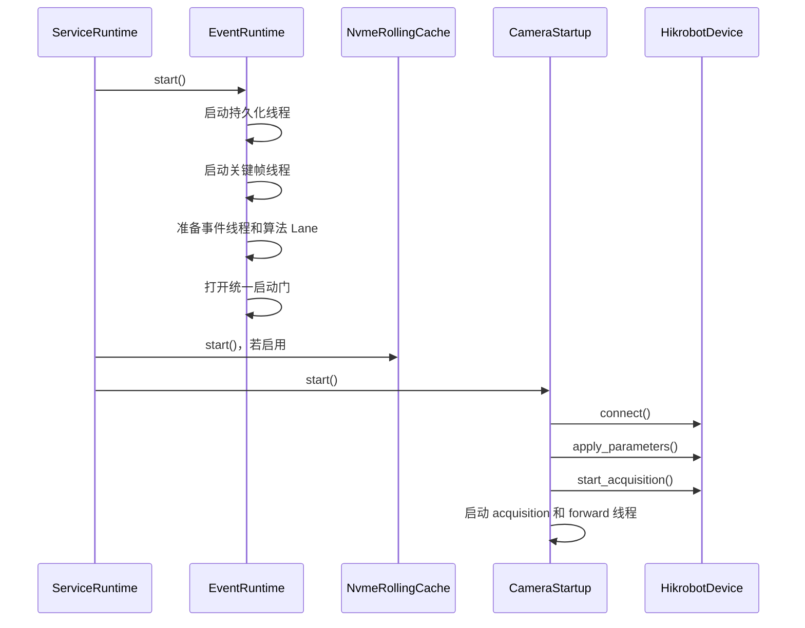

当前启动行为：

- 每个启用相机依次执行 `connect → applyConfig → start`。
- 失败时按配置重试；各相机故障相互隔离。
- 即使某台相机最终启动失败，`CameraStartupLifecycleComponent::start()` 仍返回成功，服务继续运行，以便操作员通过 IPC 诊断和恢复。
- 当前生产装配使用 `CameraControlRuntime`，没有使用代码中另一个 `RecoveringCameraSession`。
- 因此目前只有“启动阶段重试”，采集中断后没有自动重建设备/自动重连链路。

实现见 [camera_startup.cpp](</C:/Workspace/PaperBreakage/PaperBreakageAnalysis/src/service/core/src/camera_startup.cpp:80>)。

---

## 三、阶段 1：Hikrobot 取帧、缓冲和采集队列

### 3.1 MVS 适配器取帧

`AcquisitionWorker` 首先从每相机固定 `FrameBufferPool` 取得缓冲，再调用：

```cpp
MV_CC_GetOneFrameTimeout(...)
```

MVS 适配器负责：

- 把图像直接写进预分配缓冲；
- 读取宽、高、有效载荷长度、相机帧号、像素格式；
- 根据 `payload / height` 计算 stride；
- 映射 `Mono8/Mono10/Mono12/BayerRG8`；
- 读取设备时间戳，但当前标记为 `unsynchronized`；
- 将 MVS 丢包标志映射为 `FrameFlags::incomplete`；
- 把厂商错误码翻译成稳定业务错误。

实现见 [mvs_lifecycle.cpp](</C:/Workspace/PaperBreakage/PaperBreakageAnalysis/src/camera/hikrobot/src/mvs_lifecycle.cpp:1912>)。

### 3.2 AcquisitionWorker 的处理逻辑

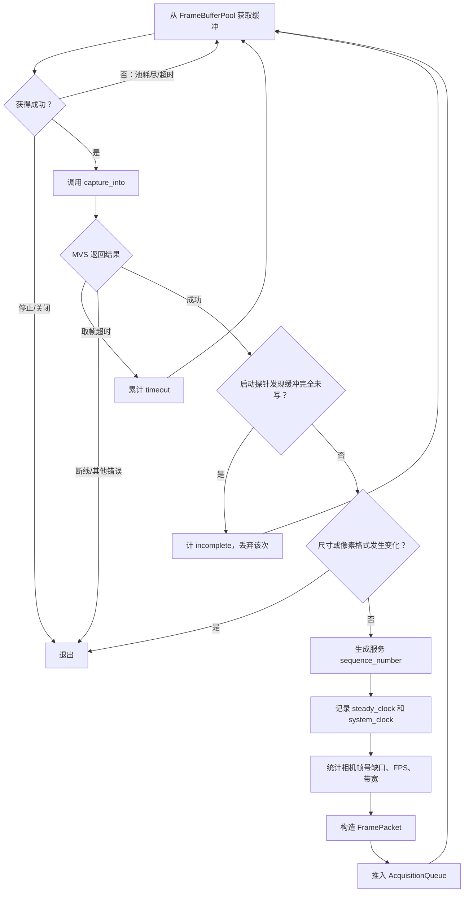

重要细节：

- 服务自己的 `sequence_number` 从 1 单调递增，与相机 `camera_frame_number` 分开。
- 相机帧号跳跃只累计缺口，不补帧。
- 采集期间尺寸或像素格式变化会终止采集线程。
- `incomplete` 帧通常仍会进入下游；只有调试启动探针判定为“缓冲完全未写”时才直接抑制。
- 生产 `CameraControlRuntime` 把连续取帧超时上限设置成 `size_t::max()`，所以普通超时会一直重试，不会触发重连。
- 非超时错误会结束采集线程，但相机控制状态可能仍显示为 `acquiring`，需要操作员停止、断开或重新启动。

实现见 [acquisition.cpp](</C:/Workspace/PaperBreakage/PaperBreakageAnalysis/src/camera/src/acquisition.cpp:344>)。

### 3.3 AcquisitionQueue 的溢出策略

该队列是每相机独立的固定环形队列：

- 当前默认容量：128 帧；
- 满载策略：删除队头最旧帧，再接受新帧；
- 不反压相机；
- 被删除帧的共享引用释放后，缓冲可能返回池；
- 关闭后拒绝新帧，但消费者可先取走关闭前已有帧。

随后 `camera-forward-<camera>` 线程取出 `FramePacket`，调用 `make_frame_view()` 检查：

- 相机 ID 非空；
- 缓冲存在；
- 宽、高、stride 非零；
- `height × stride` 不溢出；
- 有效载荷长度严格等于 `height × stride`。

通过后形成只读、持有所有权的 `FrameView`。实现见 [control.cpp](</C:/Workspace/PaperBreakage/PaperBreakageAnalysis/src/camera/src/control.cpp:264>)。

---

## 四、阶段 2：帧扇出到预览、事件和 NVMe

相机转发回调按以下固定顺序执行：

1. 预览分支；
2. 事件运行时；
3. NVMe 滚动缓存。

这里不会执行 JPEG、推理、磁盘或网络 I/O，只执行有界槽位/队列登记。

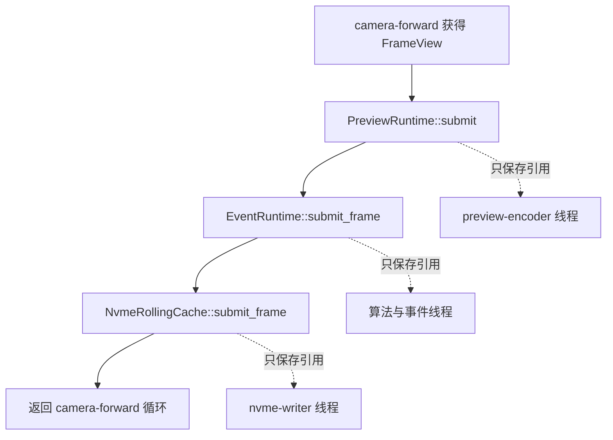

### 预览分支

- 没有订阅者：立即跳过。
- 按订阅者要求的最高 FPS 对每台相机抽样。
- 每相机只有一个待编码槽，新帧覆盖旧帧。
- 单个预览线程按相机轮转，每轮每台相机最多编码一帧。
- JPEG 编码和 IPC 发布均不在相机线程执行。

### NVMe 分支

默认配置中 `rollingCacheEnabled=false`，所以当前默认运行时不存在该分支。

启用后：

- 每相机积累约 1 秒或固定索引容量的块；
- 每相机最多排队 2 个完整块；
- 满载时丢弃刚完成的普通缓存块并形成可统计缺口；
- NVMe 故障不会阻塞正式事件的内存链。

一个日志细节：`previewAccepted` 只表示预览运行时对象存在，不代表该帧真的有订阅者或进入编码槽；NVMe 的布尔日志也只表示调用返回了成功 `Result`，不代表状态一定是 `accepted`。

---

## 五、阶段 3：EventRuntime 收帧与算法抽样

每个启用相机拥有独立 `Lane`，包含：

- 一个 `MemoryRing`；
- 一个 `DetectorHost`；
- 一个自动帧槽 `automatic_frame`；
- 一个人工保留槽 `manual_frame`；
- 一个算法工作线程；
- 最近帧和运行指标。

### 5.1 收帧入口

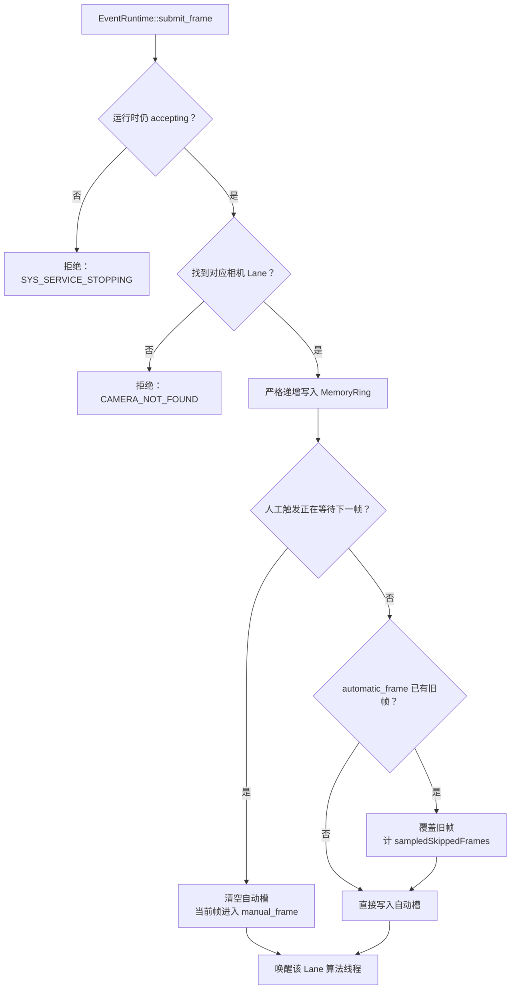

关键点：

- 每一张采集帧先进入原分辨率 `MemoryRing`，然后才参与算法抽样。
- 算法默认只保留最新待处理帧，这是主动抽样，不算队列异常。
- 当前默认相机 60 FPS、算法 15 FPS，因此算法不会处理全部采集帧，这是设计行为。
- `EventRuntimeOptions::frame_queue_capacity` 虽会被校验，但当前 `build_pipeline()` 没有使用它；实际容量固定为“自动 1 槽 + 人工 1 槽”。
- 人工触发不会处理“当前缓存帧”，而是保留请求之后到达的第一张新帧。
- 人工槽优先于自动槽，且不会被后续自动帧覆盖。

### 5.2 MemoryRing 与像素所有权

当前默认配置下，每相机：

- 前置时间 10 秒；
- 相机 60 FPS；
- 基础环约 `ceil(10 × 60) + 1 = 601` 帧；
- 实际 `MemoryRing` 再增加 2 个算法槽引用余量，即约 603 个槽；
- 帧池容量为 1939，可覆盖环、后置窗口、采集队列、算法、预览和单事件租约预算。

环缓存要求相机 ID、服务序号和单调时间严格递增。满载时覆盖最旧环槽，但已经被事件租约持有的 `FrameView` 仍继续引用原像素缓冲，所以不会被覆盖。

这也意味着：大量活动租约会占住帧池缓冲；帧池耗尽时采集线程暂时无法从 MVS 继续取帧，但不会动态扩容。

---

## 六、阶段 4：算法 Lane 调度与传统视觉检测

### 6.1 Lane 调度

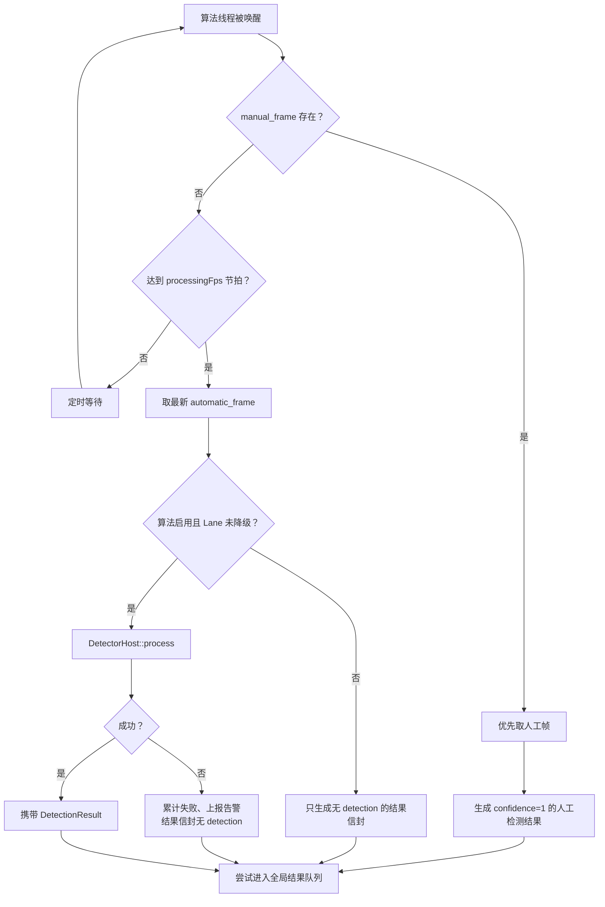

调度与降级规则：

- 每台相机独立线程，一台相机算法阻塞不会直接卡住其他相机。
- `DetectorHost` 的 100 ms 超时是“调用返回后判断耗时”，不会强制中断正在运行的检测器。
- 当前 15 FPS 的调度周期约 66.7 ms；超过周期会累计 `missedProcessingSlots`。
- 普通 latest-wins 覆盖只计 `sampledSkippedFrames`，不会触发积压报警。
- 一个 1 秒窗口内错过至少 8 个处理节拍视为坏窗口；连续 5 个坏窗口会把该 Lane 降级为 `manual-trigger-only`。
- 全局结果队列满时，拒绝新结果并立即降级对应 Lane。
- 连续检测失败达到 3 次会激活 `ALGORITHM_PROCESS_FAILED` 报警，但仍继续尝试自动检测，不直接降级。
- 积压报警可以在连续 5 个健康窗口后清除，但 `lane.degraded` 本身没有自动复位逻辑；恢复自动检测需要重配置或重启运行时。

### 6.2 当前 `classical-vision` 算法

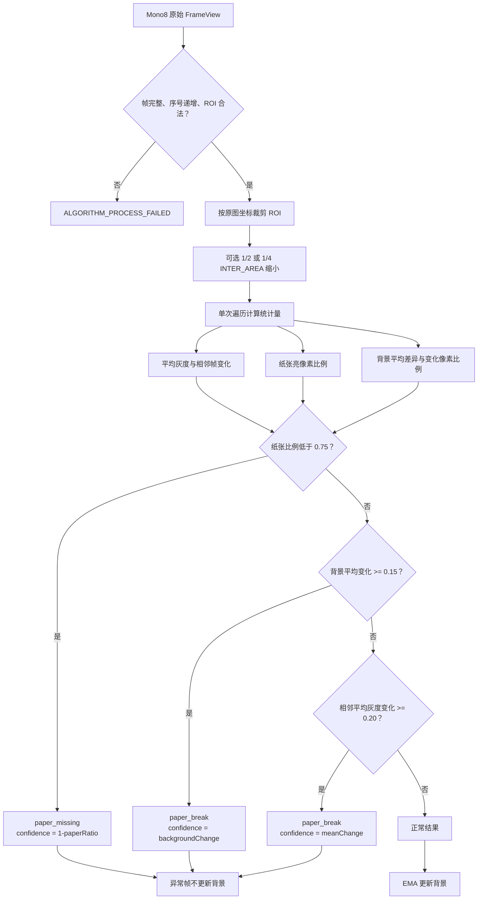

当前代码的检测优先级是：

1. 纸张占比不足；
2. 背景变化；
3. 相邻帧平均灰度变化。

其他细节：

- 只接受 `Mono8`。
- ROI 最大 4,194,304 像素。
- 下采样只影响算法工作图，不影响 MemoryRing、预览源和事件原始帧。
- 背景只在非异常结果后更新。
- 运行时只向检测器传入 ROI、下采样因子和换算后的背景学习率；纸张阈值、背景阈值和平均灰度阈值仍使用检测器内部默认值。
- 检测器内部达到异常阈值，并不等于创建候选事件。结果还要通过事件状态机的 `candidateThreshold`。
- 默认 `candidateThreshold=0.6`、`confirmationThreshold=0.8`，所以例如纸张占比虽然低于 0.75 就会产生 detector trigger，但要到 `1-paperRatio >= 0.6` 才能进入候选状态。

实现见 [classical_vision_detector.cpp](</C:/Workspace/PaperBreakage/PaperBreakageAnalysis/src/algorithm/classical/src/classical_vision_detector.cpp:287>)。

---

## 七、阶段 5：多相机结果排序与候选事件状态机

### 7.1 全局结果排序

所有 Lane 共用一个容量 256 的结果队列。

事件线程不会简单按“谁先完成谁先处理”。它先按：

```text
(received_monotonic_time, camera_id, sequence_number)
```

排序，再检查所有 Lane 中：

- 正在处理的帧；
- 自动待处理帧；
- 人工待处理帧；

取其中最早时间作为安全水位。只有严格早于安全水位的结果才进入事件状态机；没有未完成旧帧时可以立即处理。

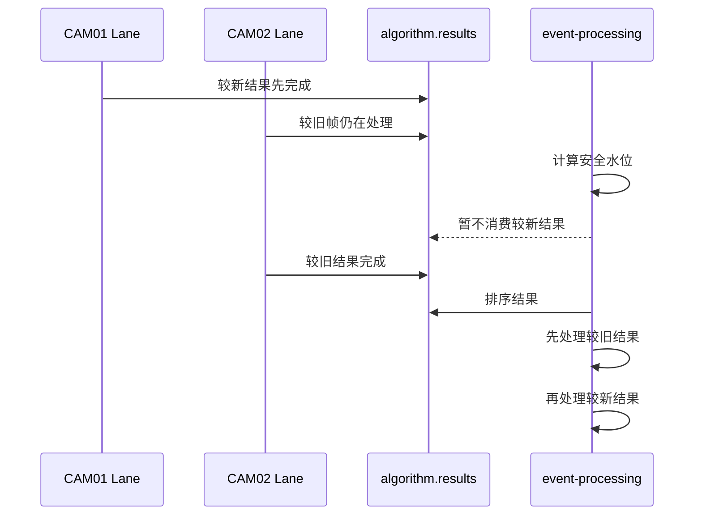

这样可避免慢相机的旧结果在事件窗口已经冻结后才迟到。

### 7.2 候选状态

生产组合把 `candidate_consecutive_frames` 固定为 1，所以第一张达到候选阈值的结果即可创建候选。

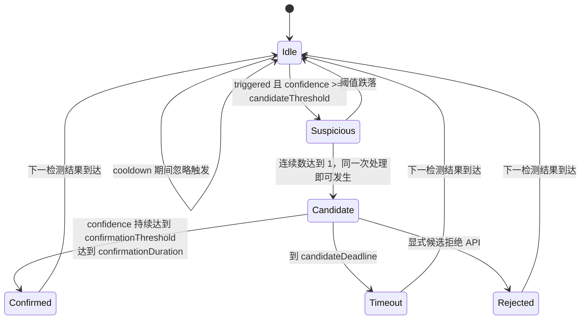

候选创建时立即执行：

1. 生成全局 `EVT-<UUIDv7>`。
2. 用触发单调时间计算 deadline。
3. 从触发相机 MemoryRing 租用 `[T-pre, T]`。
4. 记录前置窗口是否完整、帧数和序号缺口。
5. 启动/合并跨相机事件窗口。
6. 在 SQLite 创建 `Collecting` 事件记录。
7. 若 NVMe 启用，保护所有相机相同时间范围的 NVMe 块。
8. 通过 IPC 发布生命周期变化。

确认条件：

- 检测结果持续达到 `confirmationThreshold`；
- 持续时间达到默认 120 ms；
- 合格结果之间的间隔不能超过两个算法周期，否则重新计时；
- 如果 Plant IO 策略启用，还要求外部信号有效。

当前生产现状：

- 默认 `plantIo.enabled=false`。
- Hikrobot Line 0 回调目前只更新相机状态并推送 `camera.lineInputChanged`，不会调用 `EventRuntime::update_external_confirmation()`。
- `CandidateEventManager::confirm/reject()` 存在，但生产 `event.confirm/event.reject` 命令实际调用的是 SQLite 事件复核，不是活动候选状态机。因此活动候选的显式确认/拒绝 API 当前没有接入生产命令路径。
- 人工触发会在下一帧生成 confidence=1 的候选，但后续普通非触发帧会重置确认持续区间，所以人工事件通常保持 `Candidate`，随后超时；当前 `confirmed` 上传策略下需人工复核确认后才上传。

---

## 八、阶段 6：跨相机窗口合并与冻结

候选事件并不只保存触发相机。`EventWindowManager` 为所有启用相机建立窗口绑定。

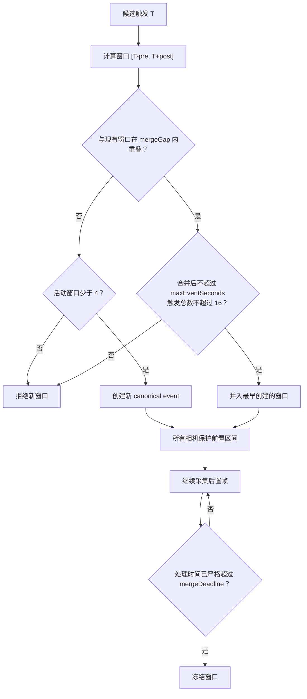

默认参数：

- 前置 10 秒；
- 后置 10 秒；
- 合并间隔 3 秒；
- 最大事件时长 60 秒；
- 最多 4 个活动窗口；
- 单一合并事件最多 16 条来源触发。

冻结过程：

1. 对每台相机汇总早期保护租约。
2. 再租用 `[最早触发时间, requested_end]` 的后置区间。
3. 按单调时间和序号排序。
4. 去除重复帧。
5. 统计序号缺口。
6. 检查时间覆盖是否连续。
7. 得到每相机 `FrozenCameraWindow`。
8. 任一相机缺历史、租约失败或有序号缺口，整个窗口标为不完整，但仍保留现有可用帧。

一个重要时间语义：窗口推进由“已经进入事件线程的帧结果时间”驱动，不是独立墙上定时器。因此没有新结果时，窗口不会自动关闭；服务停止时会提前冻结并设置 `stoppedEarly=true`。

实现见 [event_window.cpp](</C:/Workspace/PaperBreakage/PaperBreakageAnalysis/src/event/src/event_window.cpp:443>)。

---

## 九、阶段 7：关键帧选择、JPEG 与事件持久化

### 9.1 关键帧选择

窗口冻结后，当前运行时把触发帧标记为异常，其余帧视为正常，然后选择最多 7 类证据：

1. 异常前最近正常参考帧；
2. 最早异常帧；
3. 第一候选触发帧；
4. 最大变化帧；
5. 最高置信度帧；
6. 正式确认帧；
7. 触发后的状态帧。

同一帧可以承担多个理由，所以实际 JPEG 数可能少于 7。当前运行时没有传入独立的 `confirmation_frame`，因此“正式确认帧”通常会记录为缺失理由。

还有一个严格行为：关键帧选择器发现窗口中任意一帧带 `incomplete` 标志，会判定整个选择输入无效，事件转为 `Incomplete`，而不是跳过坏帧继续选择。

选中的帧进入容量 32 个任务的单线程 JPEG 队列。事件运行时同时最多跟踪 4 个等待关键帧完成的事件。

### 9.2 持久化状态机

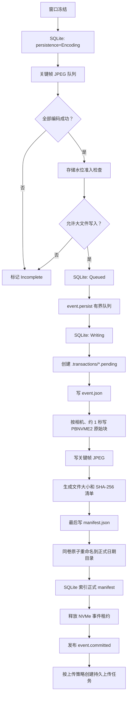

当前 `saveRaw=true`，所以保存完整冻结窗口。若关闭 `saveRaw`，代码会把窗口过滤为仅保留关键帧对应的原始帧。

原始块规则：

- 每台相机独立目录；
- 按单调时间的 1 秒桶分块；
- 几何或像素格式变化时另起块；
- 单块最多 256 帧；
- 新事件使用 `PBNVME2`；
- 文件写入过程中使用 Windows CNG 计算 SHA-256；
- `manifest.json` 最后写；
- 最后通过同卷、不覆盖目标的原子目录重命名发布。

只有原子提交后，事件才对 UI、导出和上传可见。

成功后：

- 正式目录成为文件事实源；
- SQLite 解析并索引 manifest；
- IPC 发布 `event.committed`；
- 当前默认 `uploadPolicy=confirmed`，只有数据库事件状态为 `Confirmed` 时才创建上传任务；
- 网络上传完全位于持久调度线程，不阻塞采集和事件写入。

失败时：

- JPEG、准入、持久化队列或磁盘写入失败都会把事件标为 `Incomplete`；
- 写入中断的事务目录保留，启动时扫描；
- manifest 完整且文件校验通过的残留事务可恢复提交；
- 其他残留移入 `.quarantine`；
- 事件持久化失败时，NVMe 事件租约不会释放，避免立即覆盖相关块。

实现见 [event_store.cpp](</C:/Workspace/PaperBreakage/PaperBreakageAnalysis/src/storage/src/event_store.cpp:917>)。

---

## 十、关键容量与溢出策略汇总

| 通道/资源 | 当前容量 | 满载策略 |
|---|---:|---|
| 每相机 FrameBufferPool | 默认 1939 帧 | 不扩容；采集等待/跳过本次取帧机会 |
| 每相机 AcquisitionQueue | 128 帧 | 丢最旧，接受最新 |
| 每相机 MemoryRing | 默认约 603 槽 | 覆盖最旧环槽；租约帧继续存活 |
| 算法自动槽 | 1 帧 | latest-wins，计正常抽样跳过 |
| 算法人工槽 | 1 帧 | 保留请求后的下一帧，优先消费 |
| 全局算法结果队列 | 256 条 | 拒绝新结果并降级来源 Lane |
| 活动候选 | 每相机 1 个 | 当前候选结束前不会并存第二个 |
| 活动合并窗口 | 4 个 | 拒绝新窗口 |
| 单窗口触发记录 | 16 条 | 拒绝继续合并 |
| 等待关键帧事件 | 4 个 | 新事件标记不完整 |
| 关键帧 JPEG 任务 | 32 个 | 拒绝整批提交，事件不完整 |
| 事件持久化队列 | 8 个事件 | 拒绝新事件，Critical |
| 预览槽 | 每相机 1 帧 | latest-wins |
| NVMe 完整块队列 | 每相机 2 块 | 丢当前完成块，记录缺口 |

---

## 十一、停止时如何保证确定性收尾

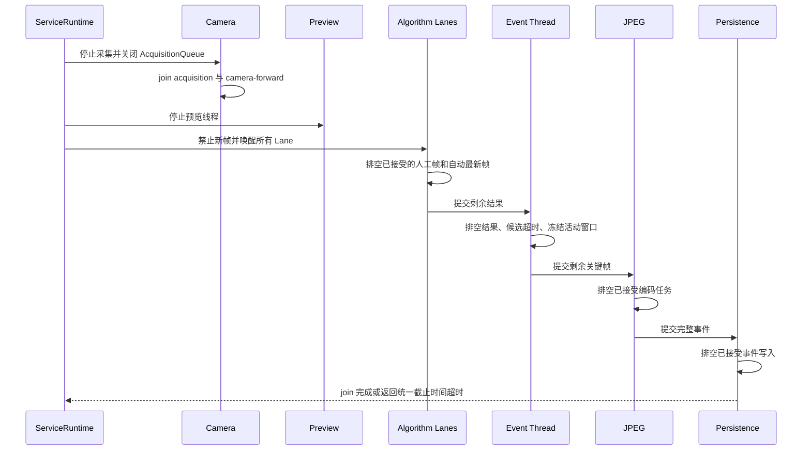

服务关闭阶段顺序为“采集先停、处理再停、事件最后收尾”，因此不会在事件线程已经关闭后继续送入相机帧。

---

## 十二、当前代码中值得特别关注的实际行为

1. 通用 `pipeline` 处理链没有装配进生产服务；生产算法链由 `EventRuntime + DetectorHost` 实现。
2. `frame_queue_capacity` 配置当前没有决定算法帧槽容量，实际固定为 2 个槽。
3. 生产相机链没有使用自动恢复会话；采集中断后不会自动重新创建设备。
4. 普通取帧超时上限被设为近似无限，持续无数据时会一直等待。
5. Line 0 只做状态展示，不进入断纸候选确认。
6. 活动候选的 `confirm/reject` 领域 API没有接入生产 IPC；IPC 同名命令是已保存事件的数据库复核。
7. 降级后的算法 Lane 不会自动恢复为自动检测，需重配置或重启。
8. 窗口关闭依赖后续算法结果推进，不是独立定时器。
9. 任意不完整帧可能导致关键帧选择整体失败。
10. 当前传统视觉插件仍明确标记为 `prototype_only=true`，不能视作已经通过正式断纸算法验收。

本次为静态代码梳理，没有修改文件、运行构建或执行实体相机测试。