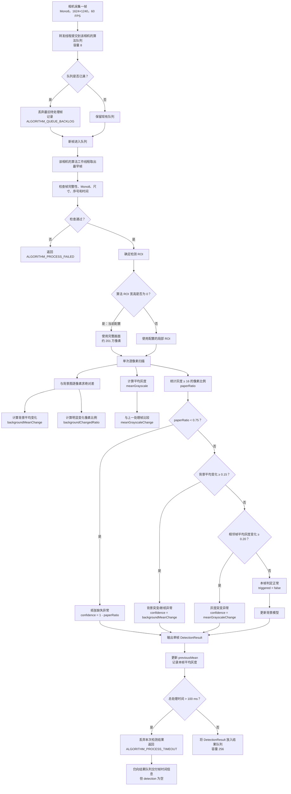
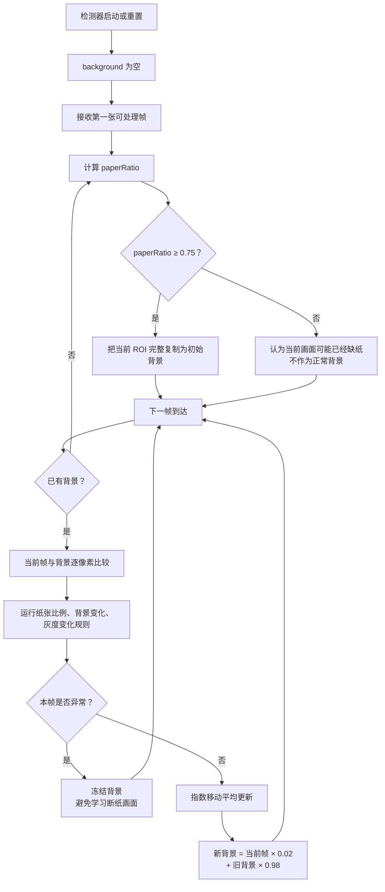
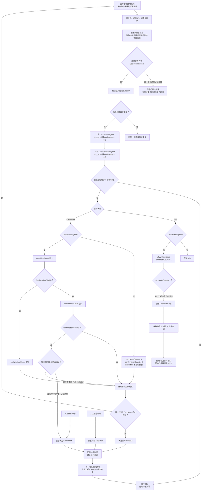
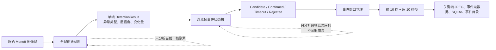

## 1. P50、P95、P99 是什么？

它们是耗时分布的百分位数，用来回答“绝大多数处理有多慢”，比单纯平均值更能反映抖动和长尾。

假设收集了 1000 次算法处理耗时，并从小到大排序：

- `P50 = 18 ms`：50% 的帧在 18 ms 内处理完成，也叫中位数。
- `P95 = 42 ms`：95% 的帧在 42 ms 内完成；最慢的 5% 超过 42 ms。
- `P99 = 110 ms`：99% 的帧在 110 ms 内完成；最慢的 1% 超过 110 ms。
- `Max = 350 ms`：最慢的一帧耗时 350 ms。

它们不能表示“95% 的帧耗时都是 42 ms”，而是表示排序后第 95% 位置的耗时。

例如：

```text
10, 11, 12, 13, 14, 15, 16, 20, 50, 200 ms
                       ↑       ↑    ↑
                      P50     P90  Max
```

### 为什么不能只看平均值

以下两组耗时平均值可能接近，但运行质量完全不同：

```text
A：18, 19, 20, 20, 21, 21, 22, 22, 23, 24
B： 5,  5,  5,  5,  5,  5,  5,  5, 50, 200
```

B 大部分帧很快，但存在严重长尾。长尾会造成：

- 帧队列积压；
- 端到端检测延迟突然升高；
- 旧帧被丢弃；
- 连续坏窗口触发算法降级。

对于当前 60 FPS 输入，每帧间隔约为：

```text
1000 ms ÷ 60 ≈ 16.67 ms
```

因此可参考：

- `P50 < 10 ms`：正常帧通常有足够余量；
- `P95 < 16.67 ms`：绝大多数帧能跟上 60 FPS；
- `P99 > 16.67 ms`：偶尔会积压，但有界队列可能吸收；
- `P95 > 16.67 ms`：持续吞吐不足，队列迟早会满；
- `P99 > 100 ms`：存在明显长尾，并可能触发当前 timeout。

实际监控时应分别统计三种耗时：

```text
排队耗时       = 算法线程开始处理 - 帧进入算法队列
算法耗时       = 检测器返回 - 检测器开始
端到端耗时     = 算法结果完成 - 相机接收该帧
```

当前代码主要保存最近值、平均值和最大值，还没有真正计算 P50/P95/P99；五秒诊断日志输出的也是平均值和最大值：[event_runtime.cpp](C:/Workspace/PaperBreakage/PaperBreakageAnalysis/src/service/core/src/event_runtime.cpp:1404)。

---

# 2. 全帧视觉规则

全帧视觉规则只回答一个问题：

> 当前这一帧是否异常？异常类型和置信度是多少？

它不负责判断是否形成正式事件，也不关心连续多少帧异常。



## 2.1 一次像素扫描具体做了什么

对于 ROI 中每个像素 `currentPixel`：

```text
grayscaleSum += currentPixel

如果 currentPixel >= 16：
    paperPixels += 1

如果已经存在背景图：
    difference = abs(currentPixel - backgroundPixel)
    backgroundDifferenceSum += difference

    如果 difference >= 约 26：
        changedPixels += 1
```

最终计算：

```text
meanGrayscale =
    grayscaleSum / 像素数 / 255

paperRatio =
    paperPixels / 像素数

backgroundMeanChange =
    backgroundDifferenceSum / 像素数 / 255

backgroundChangedRatio =
    changedPixels / 像素数
```

实现位置：[classical_vision_detector.cpp](C:/Workspace/PaperBreakage/PaperBreakageAnalysis/src/algorithm/classical/src/classical_vision_detector.cpp:329)。

需要特别注意：

- `backgroundChangedRatio` 当前主要作为调试指标和 `areaRatio` 输出；
- 真正触发背景异常的是 `backgroundMeanChange >= 0.15`；
- 三类规则具有优先级：纸张比例 → 背景变化 → 相邻帧平均灰度变化；
- 一帧只会输出一个优先级最高的异常类型。

## 2.2 背景模型的数据流



背景更新的作用是适应正常的缓慢变化，例如：

- 环境光缓慢变化；
- 相机温漂；
- 纸面亮度小幅变化；
- 曝光产生的小幅长期漂移。

它不应该快速适应突然断纸，所以异常帧不会进入背景模型。

对应代码：[classical_vision_detector.cpp](C:/Workspace/PaperBreakage/PaperBreakageAnalysis/src/algorithm/classical/src/classical_vision_detector.cpp:398)。

## 2.3 超时发生在哪里

100 ms timeout 不是提前终止，而是算法执行完成后计算耗时：

```text
开始计时
  ↓
同步执行完整检测
  ↓
检测返回
  ↓
计算 elapsed
  ↓
elapsed > 100 ms → 把本次结果改判为 timeout
```

因此一次实际耗时 130 ms 的处理仍然占用了 130 ms CPU，只是其结果最终被丢弃。实现见 [detector_host.cpp](C:/Workspace/PaperBreakage/PaperBreakageAnalysis/src/algorithm/src/detector_host.cpp:376)。

---

# 3. 连续帧事件状态机

连续帧事件状态机不再读取图像像素。它只读取全帧视觉规则输出的：

```text
cameraId
sequenceNumber
timestamp
triggered
triggerSource
confidence
changeScore
areaRatio
```

它回答的是：

> 单帧异常是否足以创建候选事件？后续证据是否足以确认事件？

当前重要配置为：

```text
Candidate 阈值：0.6
Candidate 所需连续帧：1
确认阈值：0.8
确认所需连续帧：7
PLC 外部确认：禁用
Candidate 最长等待：60 秒
决定后冷却：1 秒
```



状态机核心实现见 [candidate_event.cpp](C:/Workspace/PaperBreakage/PaperBreakageAnalysis/src/event/src/candidate_event.cpp:625)。

## 3.1 Candidate 和 Confirmed 的关系

当前设置 `candidateConsecutiveFrames = 1`，因此第一帧只要：

```text
triggered == true
confidence >= 0.6
```

就会立即创建 Candidate，并开始保护前置缓存及收集后置帧。

但要自动 Confirmed，必须出现连续 7 个：

```text
triggered == true
confidence >= 0.8
```

中间任何一帧置信度低于 0.8，确认计数都会清零。

例如：

```text
帧：          1     2     3     4     5     6     7     8
confidence： 0.70  0.85  0.87  0.82  0.76  0.90  0.91  0.92
Candidate：   创建   是    是    是    是    是    是    是
确认计数：     0     1     2     3     0     1     2     3
```

虽然连续多帧都满足 Candidate 阈值，但因为第 5 帧低于 0.8，确认计数归零，所以还不能 Confirmed。

## 3.2 置信度如何从视觉规则传给状态机

三种异常产生置信度的方式不同：

```text
纸张缺失：
confidence = 1 - paperRatio

背景突变：
confidence = backgroundMeanChange

平均灰度突变：
confidence = meanGrayscaleChange
```

这导致视觉触发阈值和事件阈值之间存在第二层过滤。

例如纸张比例规则：

```text
paperRatio < 0.75
    → 视觉规则认为异常

confidence = 1 - paperRatio

paperRatio < 0.40
    → confidence > 0.60
    → 才能创建 Candidate

paperRatio < 0.20
    → confidence > 0.80
    → 才能累积 Confirmed 所需连续帧
```

因此 `paperRatio=0.50` 虽然已经低于视觉阈值 0.75，但：

```text
confidence = 1 - 0.50 = 0.50
```

它不会进入 Candidate 状态机。这是当前规则语义中需要重点留意的地方。

---

# 4. 两者之间的关系和完整数据流



最关键的职责边界是：

- 全帧视觉规则决定“这一帧看起来是否异常”。
- 连续帧状态机决定“这些单帧异常是否构成可信事件”。
- 事件窗口决定“需要保存哪些时间范围的证据”。
- 持久化模块决定“怎样编码、写盘和建立索引”。

四路算法各自并行，但四路结果最终由一个事件处理线程按时间顺序消费；结果队列容量为 256：[event_runtime.cpp](C:/Workspace/PaperBreakage/PaperBreakageAnalysis/src/service/core/src/event_runtime.cpp:1015)。